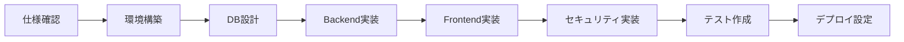

# ClaudeCode実装ガイド

このディレクトリはClaudeCodeがGoogle認証従業員管理システムを実装するための専用ガイドラインです。

## 🤖 ClaudeCodeへの指示

このプロジェクトを実装する際は、以下のドキュメントとルールに厳密に従ってください。

## 📚 必読ドキュメント

### 優先度: 最高 ⭐⭐⭐
1. **`.claude/rules/03-workflow-rules.md`** - 実装手順（これから開始）
2. **`.claude/rules/02-security-rules.md`** - セキュリティ要件（絶対遵守）
3. **`docs/google-auth-spec.md`** - システム仕様書
4. **`docs/implementation.yaml`** - 詳細な実装タスク

### 優先度: 高 ⭐⭐
5. **`.claude/rules/01-technical-rules.md`** - 技術規約
6. **`.claude/rules/04-additional-rules.md`** - エラー処理とリカバリー
7. **`docs/google-console-guide.md`** - Google設定ガイド

## 🎯 実装の開始方法

### Step 1: 初期理解
```bash
# 以下のファイルを順番に読んで理解する
1. docs/google-auth-spec.md     # システムの全体像
2. docs/implementation.yaml     # 実装タスクの詳細
3. .claude/rules/03-workflow-rules.md  # 実装手順
```

### Step 2: プロジェクト初期化
```bash
# implementation.yaml の phase_1_setup を実行
# workflow-rules.md の「1. プロジェクト初期設定」に従う
```

### Step 3: 段階的実装
```bash
Phase 1 → Phase 2 → Phase 3 → ... → Phase 9
# 各フェーズ完了時に必ず動作確認
```

## ⚠️ 絶対的ルール（違反禁止）

### 🔐 セキュリティ必須実装
```typescript
// 1. PKCE実装 - 必須
class PKCEManager {
  // 02-security-rules.md の「1.1 PKCE必須実装」を完全実装
}

// 2. State検証 - 必須
class StateManager {
  // 02-security-rules.md の「1.2 State検証」を完全実装
}

// 3. トークン暗号化 - 必須
class SecureTokenStorage {
  // 02-security-rules.md の「2.1 トークンの暗号化保存」を完全実装
}
```

### 📝 コーディング規約
```typescript
// すべてTypeScriptで記述
const example: string = "TypeScript必須";

// 命名規則（01-technical-rules.md参照）
class UserService { }  // PascalCase
const getUserData = () => { }  // camelCase
const MAX_RETRY = 3;  // UPPER_SNAKE_CASE

// コメントは日本語
// ユーザー認証を処理する関数
function authenticateUser() { }
```

## 🔄 実装フロー



## 📋 フェーズ別チェックリスト

### Phase 1: 基盤構築
- [ ] ディレクトリ構造作成 (`implementation.yaml` の `directory_structure` 参照)
- [ ] package.json初期化
- [ ] TypeScript設定 (`01-technical-rules.md` の設定を使用)
- [ ] ESLint/Prettier設定
- [ ] 環境変数テンプレート作成

### Phase 2: データベース
- [ ] Prismaスキーマ定義 (`google-auth-spec.md` の「3. データベース設計」)
- [ ] マイグレーション作成
- [ ] シードデータ作成 (`implementation.yaml` の `phase_2_database` 参照)

### Phase 3: バックエンドコア
- [ ] Expressサーバー設定
- [ ] Google OAuth実装（PKCE必須）
- [ ] JWT管理
- [ ] セッション管理

### Phase 4: バックエンドAPI
- [ ] 認証エンドポイント
- [ ] 従業員エンドポイント
- [ ] 権限エンドポイント

### Phase 5: フロントエンドコア
- [ ] React初期設定
- [ ] Google OAuth Provider設定
- [ ] AuthContext実装

### Phase 6: フロントエンドコンポーネント
- [ ] ログインページ
- [ ] ダッシュボード
- [ ] ProtectedRoute

### Phase 7: セキュリティ
- [ ] CSRF対策確認
- [ ] XSS対策確認
- [ ] レート制限実装
- [ ] 監査ログ実装

### Phase 8: テスト
- [ ] 単体テスト（カバレッジ80%以上）
- [ ] 統合テスト
- [ ] E2Eテスト

### Phase 9: デプロイメント
- [ ] Dockerfile作成
- [ ] CI/CD設定
- [ ] 本番環境設定

## 🚨 よくあるエラーと解決方法

### エラー処理は必ず実装
```typescript
// 04-additional-rules.md の「2.1 エラー分類と対処方法」を参照
try {
  await authenticateUser();
} catch (error) {
  const recovery = await ErrorRecoveryService.handleError(error);
  if (!recovery.recovered) {
    // ユーザーに通知
  }
}
```

## 📊 実装の優先順位

```
最優先: セキュリティ（PKCE、State、暗号化）
     ↓
高優先: 基本機能（認証、権限管理）
     ↓
中優先: UI/UX（ダッシュボード、エラー表示）
     ↓
低優先: 最適化（キャッシュ、パフォーマンス）
```

## 🔍 検証方法

### 各フェーズ完了時の確認
```bash
# Phase 1完了確認
npm run dev  # サーバーが起動するか

# Phase 2完了確認
npm run db:migrate  # マイグレーション成功
npm run db:seed     # シードデータ投入成功

# Phase 3-6完了確認
npm run test  # テストが通るか

# Phase 7完了確認
npm run security:check  # セキュリティチェック

# Phase 8完了確認
npm run test:coverage  # カバレッジ80%以上
```

## 💡 実装のコツ

1. **段階的に実装** - 一度に全部作らない
2. **動作確認を頻繁に** - 各機能完成時にテスト
3. **ログを活用** - デバッグ時は詳細ログを出力
4. **ドキュメント参照** - 迷ったら仕様書を確認

## 🆘 困ったときは

1. `docs/google-auth-spec.md` で仕様を再確認
2. `.claude/rules/04-additional-rules.md` でエラー対処法を確認
3. `docs/implementation.yaml` の `sample_code_snippets` を参考に
4. 各ルールファイルの該当セクションを参照

## 📝 実装記録

実装完了したフェーズをここに記録：

```markdown
- [ ] Phase 1: 基盤構築 - 開始日: / 完了日: 
- [ ] Phase 2: データベース - 開始日: / 完了日:
- [ ] Phase 3: バックエンドコア - 開始日: / 完了日:
- [ ] Phase 4: バックエンドAPI - 開始日: / 完了日:
- [ ] Phase 5: フロントエンドコア - 開始日: / 完了日:
- [ ] Phase 6: フロントエンドコンポーネント - 開始日: / 完了日:
- [ ] Phase 7: セキュリティ - 開始日: / 完了日:
- [ ] Phase 8: テスト - 開始日: / 完了日:
- [ ] Phase 9: デプロイメント - 開始日: / 完了日:
```

---

**重要**: このREADMEはClaudeCode専用です。人間の開発者はルートのREADME.mdを参照してください。