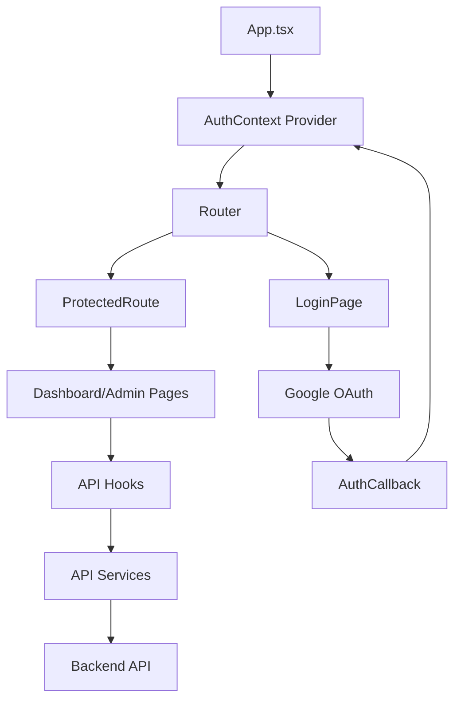
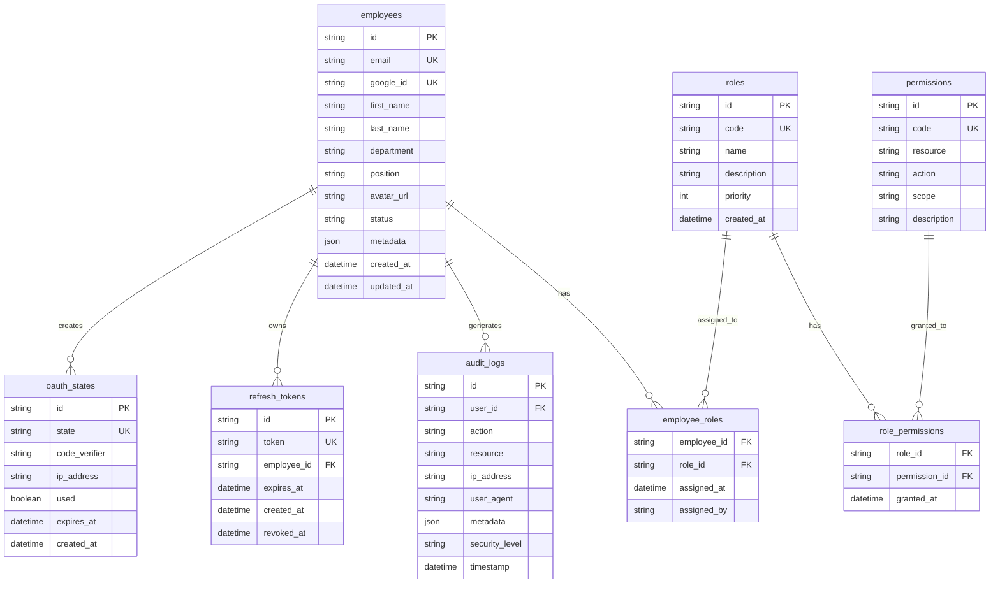
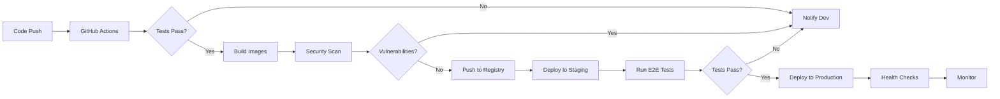

# Architecture Documentation - Google Auth Employee System

## Table of Contents
1. [System Overview](#system-overview)
2. [Architecture Principles](#architecture-principles)
3. [System Architecture](#system-architecture)
4. [Component Architecture](#component-architecture)
5. [Data Architecture](#data-architecture)
6. [Security Architecture](#security-architecture)
7. [Integration Architecture](#integration-architecture)
8. [Deployment Architecture](#deployment-architecture)
9. [Performance Architecture](#performance-architecture)
10. [Technology Stack](#technology-stack)

## System Overview

The Google Auth Employee System is a modern, secure, and scalable employee management platform that leverages Google OAuth 2.0 for authentication and implements comprehensive role-based access control (RBAC).

### Key Characteristics
- **Microservices-ready**: Modular design supporting service decomposition
- **Cloud-native**: Container-first, stateless application design
- **Security-first**: Zero-trust architecture with defense in depth
- **Scalable**: Horizontal scaling with load balancing
- **Observable**: Comprehensive monitoring and logging

## Architecture Principles

### Design Principles

1. **Separation of Concerns**
   - Clear boundaries between layers
   - Single responsibility per component
   - Loose coupling, high cohesion

2. **Security by Design**
   - Authentication at the edge
   - Authorization at every layer
   - Encryption in transit and at rest
   - Principle of least privilege

3. **Scalability & Performance**
   - Stateless application tier
   - Database connection pooling
   - Caching at multiple levels
   - Asynchronous processing

4. **Reliability & Resilience**
   - Circuit breaker pattern
   - Retry with exponential backoff
   - Graceful degradation
   - Health checks and auto-recovery

5. **Developer Experience**
   - Type safety with TypeScript
   - Consistent API design
   - Comprehensive documentation
   - Automated testing

## System Architecture

### High-Level Architecture

```
┌─────────────────────────────────────────────────────────────────┐
│                         Internet                                 │
└─────────────────────────┬───────────────────────────────────────┘
                          │
                    ┌─────▼─────┐
                    │   CDN     │
                    │(CloudFlare)│
                    └─────┬─────┘
                          │
                    ┌─────▼─────┐
                    │    WAF    │
                    └─────┬─────┘
                          │
                    ┌─────▼─────┐
                    │   Load    │
                    │ Balancer  │
                    └─────┬─────┘
                          │
            ┌─────────────┼─────────────┐
            │             │             │
      ┌─────▼─────┐ ┌────▼─────┐ ┌────▼─────┐
      │  Frontend │ │ Frontend │ │ Frontend │
      │  (React)  │ │  (React) │ │  (React) │
      └─────┬─────┘ └────┬─────┘ └────┬─────┘
            │             │             │
            └─────────────┼─────────────┘
                          │
                    ┌─────▼─────┐
                    │    API    │
                    │  Gateway  │
                    └─────┬─────┘
                          │
            ┌─────────────┼─────────────┐
            │             │             │
      ┌─────▼─────┐ ┌────▼─────┐ ┌────▼─────┐
      │  Backend  │ │  Backend │ │  Backend │
      │  Service  │ │  Service │ │  Service │
      └─────┬─────┘ └────┬─────┘ └────┬─────┘
            │             │             │
            └─────────────┼─────────────┘
                          │
        ┌─────────────────┼─────────────────┐
        │                 │                 │
  ┌─────▼─────┐    ┌─────▼─────┐    ┌─────▼─────┐
  │PostgreSQL │    │   Redis   │    │    S3     │
  │  Primary  │    │  Cluster  │    │  Storage  │
  └─────┬─────┘    └───────────┘    └───────────┘
        │
  ┌─────▼─────┐
  │PostgreSQL │
  │  Replica  │
  └───────────┘
```

### Layered Architecture

```
┌────────────────────────────────────────────────┐
│              Presentation Layer                │
│         (React, Material-UI, TypeScript)       │
├────────────────────────────────────────────────┤
│               API Gateway Layer                │
│          (Nginx, Rate Limiting, SSL)           │
├────────────────────────────────────────────────┤
│             Application Layer                  │
│       (Express, Controllers, Services)         │
├────────────────────────────────────────────────┤
│              Business Logic Layer              │
│     (Domain Models, Validation, Rules)         │
├────────────────────────────────────────────────┤
│             Data Access Layer                  │
│         (Prisma ORM, Repositories)             │
├────────────────────────────────────────────────┤
│              Data Storage Layer                │
│        (PostgreSQL, Redis, S3)                 │
└────────────────────────────────────────────────┘
```

## Component Architecture

### Frontend Architecture

```
frontend/
├── src/
│   ├── components/          # UI Components
│   │   ├── auth/            # Authentication components
│   │   │   ├── LoginPage.tsx
│   │   │   ├── AuthCallback.tsx
│   │   │   └── ProtectedRoute.tsx
│   │   ├── admin/           # Admin components
│   │   │   └── AdminPage.tsx
│   │   ├── dashboard/       # Dashboard components
│   │   │   └── Dashboard.tsx
│   │   └── common/          # Shared components
│   │       ├── Header.tsx
│   │       ├── Footer.tsx
│   │       └── ErrorBoundary.tsx
│   ├── contexts/            # React Contexts
│   │   └── AuthContext.tsx
│   ├── hooks/               # Custom React Hooks
│   │   ├── useAuth.ts
│   │   ├── usePermissions.ts
│   │   └── useApi.ts
│   ├── services/            # API Services
│   │   ├── api/
│   │   │   └── auth.ts
│   │   └── security/
│   │       └── pkce.ts
│   ├── utils/               # Utility Functions
│   │   ├── auth.ts
│   │   └── validators.ts
│   └── types/               # TypeScript Types
│       └── index.ts
```

#### Component Interaction Flow



### Backend Architecture

```
backend/
├── src/
│   ├── server.ts            # Application entry point
│   ├── app.ts              # Express app configuration
│   ├── config/             # Configuration management
│   │   ├── env.ts          # Environment variables
│   │   └── redis.ts        # Redis configuration
│   ├── controllers/        # Request handlers
│   │   └── authController.ts
│   ├── services/           # Business logic
│   │   ├── googleAuthService.ts
│   │   ├── jwtService.ts
│   │   └── auditService.ts
│   ├── middleware/         # Express middleware
│   │   ├── auth.ts         # Authentication
│   │   ├── authorize.ts    # Authorization
│   │   ├── rateLimiter.ts  # Rate limiting
│   │   ├── security.ts     # Security headers
│   │   └── validation.ts   # Input validation
│   ├── routes/             # API routes
│   │   ├── authRoutes.ts
│   │   └── admin.ts
│   ├── database/           # Database layer
│   │   └── prisma/
│   │       └── schema.prisma
│   └── types/              # TypeScript types
│       └── index.ts
```

#### Service Layer Architecture

```typescript
// Service layer abstraction
interface IAuthService {
  generateAuthUrl(): Promise<AuthUrlResponse>;
  exchangeCodeForTokens(code: string): Promise<TokenResponse>;
  refreshAccessToken(refreshToken: string): Promise<AccessTokenResponse>;
  revokeTokens(userId: string): Promise<void>;
}

interface IUserService {
  findByEmail(email: string): Promise<User | null>;
  create(userData: CreateUserDto): Promise<User>;
  update(id: string, data: UpdateUserDto): Promise<User>;
  assignRole(userId: string, roleId: string): Promise<void>;
}

interface IAuditService {
  log(event: AuditEvent): Promise<void>;
  getEvents(filter: AuditFilter): Promise<AuditEvent[]>;
}
```

### Middleware Pipeline

```
Request → 
  ├── Security Headers
  ├── CORS
  ├── Rate Limiting
  ├── Request ID
  ├── Body Parser
  ├── Request Validation
  ├── Authentication
  ├── Authorization
  ├── Controller
  ├── Service Layer
  ├── Data Access
  └── Response
```

## Data Architecture

### Database Schema



### Data Flow Architecture

```
┌─────────────┐     ┌─────────────┐     ┌─────────────┐
│   Client    │────▶│   Backend   │────▶│   Prisma    │
│  Request    │     │ Controller  │     │     ORM     │
└─────────────┘     └─────────────┘     └─────────────┘
                            │                    │
                            ▼                    ▼
                    ┌─────────────┐     ┌─────────────┐
                    │   Service   │     │ PostgreSQL  │
                    │    Layer    │────▶│  Database   │
                    └─────────────┘     └─────────────┘
                            │                    ▲
                            ▼                    │
                    ┌─────────────┐             │
                    │    Redis    │─────────────┘
                    │    Cache    │
                    └─────────────┘
```

### Caching Strategy

```yaml
Cache Layers:
  CDN:
    - Static assets
    - Public API responses
    TTL: 1 year (immutable assets)
  
  Application:
    - Session data
    - User permissions
    - Frequently accessed data
    TTL: 5-15 minutes
  
  Database:
    - Query results
    - Prepared statements
    TTL: Connection lifetime

Cache Patterns:
  - Cache-aside (lazy loading)
  - Write-through
  - TTL-based invalidation
  - Event-based invalidation
```

## Security Architecture

### Authentication Flow

```
┌──────────┐                                           ┌──────────┐
│  User    │                                           │  Google  │
└────┬─────┘                                           └────┬─────┘
     │                                                       │
     │ 1. Login Request                                      │
     ▼                                                       │
┌──────────┐                                                 │
│ Frontend │                                                 │
└────┬─────┘                                                 │
     │ 2. GET /api/auth/google                               │
     ▼                                                       │
┌──────────┐                                                 │
│ Backend  │                                                 │
│          │ 3. Generate PKCE & State                        │
│          │────────────────────────────────────────────────▶│
│          │                                                 │
│          │ 4. Return Auth URL                              │
│          │◀────────────────────────────────────────────────│
└────┬─────┘                                                 │
     │ 5. Redirect to Google                                 │
     ▼                                                       ▼
┌──────────┐                                           ┌──────────┐
│  User    │◀──────────────────────────────────────────│  Google  │
│          │ 6. User Consent                           │  OAuth   │
│          │───────────────────────────────────────────▶│          │
└────┬─────┘                                           └────┬─────┘
     │ 7. Callback with Code                                │
     ▼                                                       │
┌──────────┐                                                 │
│ Frontend │                                                 │
└────┬─────┘                                                 │
     │ 8. POST /api/auth/google/callback                    │
     ▼                                                       │
┌──────────┐                                                 │
│ Backend  │                                                 │
│          │ 9. Verify State & PKCE                          │
│          │────────────────────────────────────────────────▶│
│          │                                                 │
│          │ 10. Exchange Code for Tokens                    │
│          │◀────────────────────────────────────────────────│
│          │                                                 │
│          │ 11. Create/Update User                          │
│          │ 12. Generate JWT Tokens                         │
│          │ 13. Create Session                              │
└────┬─────┘                                                 │
     │ 14. Return Tokens & User Info                        │
     ▼                                                       │
┌──────────┐                                                 │
│ Frontend │                                                 │
│          │ 15. Store Tokens                               │
│          │ 16. Redirect to Dashboard                       │
└──────────┘                                                 │
```

### Authorization Architecture

```typescript
// Multi-layer authorization
class AuthorizationService {
  // Route-level authorization
  async authorizeRoute(user: User, route: string): Promise<boolean> {
    const requiredPermissions = this.getRoutePermissions(route);
    return this.hasPermissions(user, requiredPermissions);
  }

  // Resource-level authorization
  async authorizeResource(
    user: User, 
    resource: string, 
    action: string
  ): Promise<boolean> {
    const permission = `${resource}:${action}`;
    return this.hasPermission(user, permission);
  }

  // Field-level authorization
  async authorizeFields(
    user: User, 
    resource: any, 
    fields: string[]
  ): Promise<string[]> {
    return fields.filter(field => 
      this.canAccessField(user, resource, field)
    );
  }

  // Hierarchical permission check
  private hasPermission(user: User, permission: string): boolean {
    // Check exact permission
    if (user.permissions.includes(permission)) return true;
    
    // Check wildcard permissions
    const [resource, action, scope] = permission.split(':');
    if (user.permissions.includes(`${resource}:*`)) return true;
    if (user.permissions.includes('*:*:*')) return true;
    
    // Check role hierarchy
    return this.checkRoleHierarchy(user.roles, permission);
  }
}
```

### Security Zones

```
┌─────────────────────────────────────────────────┐
│                 Public Zone                      │
│  - Static assets                                 │
│  - Login page                                    │
│  - OAuth callbacks                               │
└─────────────────────────────────────────────────┘
                        │
                  [WAF + DDoS Protection]
                        │
┌─────────────────────────────────────────────────┐
│              Authenticated Zone                  │
│  - Dashboard                                     │
│  - Employee profiles                             │
│  - Read-only operations                          │
└─────────────────────────────────────────────────┘
                        │
                  [Role-Based Access]
                        │
┌─────────────────────────────────────────────────┐
│               Privileged Zone                    │
│  - Admin panel                                   │
│  - User management                               │
│  - System configuration                          │
└─────────────────────────────────────────────────┘
                        │
                  [MFA + Audit Logging]
                        │
┌─────────────────────────────────────────────────┐
│                Restricted Zone                   │
│  - Database direct access                        │
│  - System administration                         │
│  - Security configurations                       │
└─────────────────────────────────────────────────┘
```

## Integration Architecture

### External System Integration

```
┌──────────────┐     ┌──────────────┐     ┌──────────────┐
│   Employee   │────▶│   Adapter    │────▶│   External   │
│   System     │     │   Layer      │     │   System     │
└──────────────┘     └──────────────┘     └──────────────┘
                            │
                     ┌──────┼──────┐
                     │      │      │
              ┌──────▼──┐ ┌─▼──┐ ┌─▼──────┐
              │ Google  │ │LDAP│ │  HRIS  │
              │  OAuth  │ │    │ │        │
              └─────────┘ └────┘ └────────┘
```

### Event-Driven Architecture

```typescript
// Event bus for system integration
class EventBus {
  private subscribers: Map<string, EventHandler[]> = new Map();

  publish(event: SystemEvent): void {
    const handlers = this.subscribers.get(event.type) || [];
    handlers.forEach(handler => {
      try {
        handler(event);
      } catch (error) {
        this.handleError(error, event);
      }
    });
  }

  subscribe(eventType: string, handler: EventHandler): void {
    const handlers = this.subscribers.get(eventType) || [];
    handlers.push(handler);
    this.subscribers.set(eventType, handlers);
  }
}

// System events
enum SystemEvents {
  USER_CREATED = 'user.created',
  USER_UPDATED = 'user.updated',
  USER_DELETED = 'user.deleted',
  ROLE_ASSIGNED = 'role.assigned',
  LOGIN_SUCCESS = 'auth.login.success',
  LOGIN_FAILED = 'auth.login.failed',
  SECURITY_ALERT = 'security.alert'
}
```

### API Gateway Pattern

```
┌──────────────────────────────────────────────┐
│                API Gateway                   │
│                                              │
│  - Authentication                            │
│  - Rate Limiting                            │
│  - Request Routing                          │
│  - Response Caching                         │
│  - Load Balancing                           │
│  - Circuit Breaking                         │
│  - Request/Response Transformation          │
│  - Analytics & Monitoring                   │
└──────────────────────────────────────────────┘
                     │
        ┌────────────┼────────────┐
        │            │            │
   ┌────▼────┐ ┌────▼────┐ ┌────▼────┐
   │  Auth   │ │Employee │ │ Admin   │
   │ Service │ │ Service │ │Service  │
   └─────────┘ └─────────┘ └─────────┘
```

## Deployment Architecture

### Container Architecture

```yaml
# Docker container structure
services:
  frontend:
    build: ./frontend
    environment:
      - NODE_ENV=production
    networks:
      - frontend-net
    deploy:
      replicas: 3
      resources:
        limits:
          cpus: '0.5'
          memory: 512M

  backend:
    build: ./backend
    environment:
      - NODE_ENV=production
    networks:
      - backend-net
      - db-net
    deploy:
      replicas: 3
      resources:
        limits:
          cpus: '1'
          memory: 1G

  database:
    image: postgres:15
    networks:
      - db-net
    volumes:
      - db-data:/var/lib/postgresql/data
    deploy:
      placement:
        constraints:
          - node.role == manager
```

### CI/CD Pipeline



### Infrastructure as Code

```terraform
# Terraform configuration
resource "aws_ecs_cluster" "main" {
  name = "employee-system-cluster"
}

resource "aws_ecs_service" "backend" {
  name            = "backend-service"
  cluster         = aws_ecs_cluster.main.id
  task_definition = aws_ecs_task_definition.backend.arn
  desired_count   = 3

  deployment_configuration {
    maximum_percent         = 200
    minimum_healthy_percent = 100
  }

  load_balancer {
    target_group_arn = aws_lb_target_group.backend.arn
    container_name   = "backend"
    container_port   = 5000
  }
}

resource "aws_rds_cluster" "postgres" {
  cluster_identifier      = "employee-db-cluster"
  engine                  = "aurora-postgresql"
  engine_version         = "15.2"
  master_username        = var.db_username
  master_password        = var.db_password
  backup_retention_period = 30
  preferred_backup_window = "03:00-04:00"
  
  serverlessv2_scaling_configuration {
    max_capacity = 1
    min_capacity = 0.5
  }
}
```

## Performance Architecture

### Performance Optimization Strategies

```typescript
// Connection pooling
const pool = new Pool({
  max: 20,           // Maximum connections
  min: 5,            // Minimum connections
  idle: 10000,       // Idle timeout
  acquire: 30000,    // Acquire timeout
  evict: 1000        // Eviction run interval
});

// Query optimization
const optimizedQuery = `
  SELECT e.id, e.email, e.first_name, e.last_name,
         array_agg(DISTINCT r.code) as roles
  FROM employees e
  LEFT JOIN employee_roles er ON e.id = er.employee_id
  LEFT JOIN roles r ON er.role_id = r.id
  WHERE e.status = 'active'
    AND e.department = $1
  GROUP BY e.id
  LIMIT $2 OFFSET $3
`;

// Response compression
app.use(compression({
  filter: (req, res) => {
    if (req.headers['x-no-compression']) {
      return false;
    }
    return compression.filter(req, res);
  },
  level: 6 // Balanced compression
}));

// Lazy loading & code splitting
const AdminPanel = lazy(() => import('./components/AdminPanel'));

// Database indexing strategy
CREATE INDEX CONCURRENTLY idx_employees_status_dept 
  ON employees(status, department) 
  WHERE status = 'active';
```

### Load Balancing Strategy

```nginx
upstream backend_cluster {
    least_conn;
    
    server backend1:5000 weight=3 max_fails=2 fail_timeout=30s;
    server backend2:5000 weight=3 max_fails=2 fail_timeout=30s;
    server backend3:5000 weight=2 max_fails=2 fail_timeout=30s;
    
    keepalive 32;
}

server {
    location /api {
        proxy_pass http://backend_cluster;
        proxy_http_version 1.1;
        proxy_set_header Connection "";
        
        # Connection pooling
        proxy_connect_timeout 60s;
        proxy_send_timeout 60s;
        proxy_read_timeout 60s;
        
        # Buffering
        proxy_buffering on;
        proxy_buffer_size 4k;
        proxy_buffers 8 4k;
    }
}
```

### Monitoring & Observability

```typescript
// Application metrics
import { Counter, Histogram, register } from 'prom-client';

const httpDuration = new Histogram({
  name: 'http_request_duration_seconds',
  help: 'Duration of HTTP requests in seconds',
  labelNames: ['method', 'route', 'status'],
  buckets: [0.1, 0.5, 1, 2, 5]
});

const dbQueryDuration = new Histogram({
  name: 'db_query_duration_seconds',
  help: 'Duration of database queries',
  labelNames: ['operation', 'table'],
  buckets: [0.01, 0.05, 0.1, 0.5, 1]
});

// Distributed tracing
import { trace } from '@opentelemetry/api';

const tracer = trace.getTracer('employee-system', '1.0.0');

export async function tracedOperation(name: string, fn: Function) {
  const span = tracer.startSpan(name);
  try {
    const result = await fn();
    span.setStatus({ code: SpanStatusCode.OK });
    return result;
  } catch (error) {
    span.recordException(error);
    span.setStatus({ code: SpanStatusCode.ERROR });
    throw error;
  } finally {
    span.end();
  }
}
```

## Technology Stack

### Core Technologies

| Layer | Technology | Version | Purpose |
|-------|------------|---------|---------|
| **Frontend** | | | |
| Framework | React | 18.2.0 | UI framework |
| Language | TypeScript | 5.x | Type safety |
| UI Library | Material-UI | 5.x | Component library |
| State Management | Context API | - | Global state |
| Routing | React Router | 6.x | Client routing |
| HTTP Client | Axios | 1.x | API communication |
| Build Tool | Webpack | 5.x | Module bundling |
| **Backend** | | | |
| Runtime | Node.js | 18.x LTS | JavaScript runtime |
| Framework | Express | 4.x | Web framework |
| Language | TypeScript | 5.x | Type safety |
| ORM | Prisma | 5.x | Database abstraction |
| Authentication | Passport | 0.6.x | Auth strategies |
| Validation | Joi/Zod | Latest | Schema validation |
| **Database** | | | |
| Primary DB | PostgreSQL | 15.x | Relational database |
| Cache | Redis | 7.x | In-memory cache |
| Search | Elasticsearch | 8.x | Full-text search |
| **Infrastructure** | | | |
| Container | Docker | 24.x | Containerization |
| Orchestration | Kubernetes | 1.28.x | Container orchestration |
| Reverse Proxy | Nginx | 1.24.x | Load balancing |
| CDN | CloudFlare | - | Content delivery |
| **Monitoring** | | | |
| APM | New Relic | Latest | Performance monitoring |
| Logs | ELK Stack | 8.x | Log aggregation |
| Metrics | Prometheus | 2.x | Metrics collection |
| Visualization | Grafana | 10.x | Metrics dashboard |
| **Security** | | | |
| OAuth Provider | Google | OAuth 2.0 | Authentication |
| Secrets Manager | Vault | 1.15.x | Secret management |
| WAF | CloudFlare | - | Web application firewall |
| Scanner | Trivy | Latest | Vulnerability scanning |

### Development Tools

| Tool | Purpose |
|------|---------|
| ESLint | Code linting |
| Prettier | Code formatting |
| Jest | Unit testing |
| Cypress | E2E testing |
| Husky | Git hooks |
| Commitizen | Commit standards |
| Swagger | API documentation |
| Postman | API testing |

### Architecture Decision Records (ADRs)

#### ADR-001: Use of TypeScript
**Status**: Accepted
**Context**: Need for type safety and better developer experience
**Decision**: Use TypeScript for both frontend and backend
**Consequences**: Improved code quality, better IDE support, learning curve for team

#### ADR-002: PostgreSQL as Primary Database
**Status**: Accepted
**Context**: Need for ACID compliance and complex queries
**Decision**: Use PostgreSQL over NoSQL alternatives
**Consequences**: Strong consistency, complex queries support, vertical scaling limitations

#### ADR-003: JWT for Session Management
**Status**: Accepted
**Context**: Need for stateless authentication
**Decision**: Use JWT with refresh token pattern
**Consequences**: Scalable authentication, token management complexity

#### ADR-004: Microservices-Ready Architecture
**Status**: Accepted
**Context**: Anticipated growth and need for independent scaling
**Decision**: Design with service boundaries even in monolith
**Consequences**: Easy to split later, initial complexity overhead

---

*Last Updated: 2025-08-10*
*Version: 1.0.0*
*Architecture Version: Production-Ready*