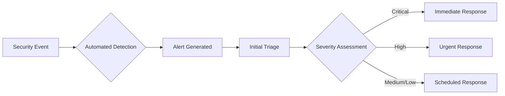

# Security Documentation - Google Auth Employee System

## Table of Contents
1. [Security Overview](#security-overview)
2. [Authentication Architecture](#authentication-architecture)
3. [Security Features](#security-features)
4. [Known Vulnerabilities & Fixes](#known-vulnerabilities--fixes)
5. [Security Best Practices](#security-best-practices)
6. [Threat Model](#threat-model)
7. [Compliance & Standards](#compliance--standards)
8. [Security Configuration](#security-configuration)
9. [Incident Response](#incident-response)
10. [Security Checklist](#security-checklist)

## Security Overview

The Google Auth Employee System implements a defense-in-depth security strategy with multiple layers of protection. This document details the security architecture, implemented controls, and guidelines for maintaining system security.

### Security Principles
- **Principle of Least Privilege**: Users and processes operate with minimal required permissions
- **Defense in Depth**: Multiple security layers protect against various attack vectors
- **Zero Trust Architecture**: All requests are verified regardless of source
- **Security by Design**: Security considerations integrated throughout the development lifecycle
- **Continuous Monitoring**: Real-time security event monitoring and logging

## Authentication Architecture

### OAuth 2.0 with PKCE Implementation

The system uses Google OAuth 2.0 with Proof Key for Code Exchange (PKCE) for enhanced security:

```
┌──────────┐      ┌──────────┐      ┌──────────┐      ┌──────────┐
│  Client  │      │ Backend  │      │  Google  │      │   Redis  │
└────┬─────┘      └────┬─────┘      └────┬─────┘      └────┬─────┘
     │                  │                  │                  │
     │ 1. Request Auth  │                  │                  │
     │─────────────────>│                  │                  │
     │                  │                  │                  │
     │                  │ 2. Generate      │                  │
     │                  │    PKCE & State  │                  │
     │                  │─────────────────>│                  │
     │                  │                  │                  │
     │ 3. Auth URL      │                  │                  │
     │<─────────────────│                  │                  │
     │                  │                  │                  │
     │ 4. Redirect to Google               │                  │
     │────────────────────────────────────>│                  │
     │                  │                  │                  │
     │ 5. User Consent  │                  │                  │
     │<────────────────────────────────────│                  │
     │                  │                  │                  │
     │ 6. Callback with │                  │                  │
     │    Code & State  │                  │                  │
     │─────────────────>│                  │                  │
     │                  │                  │                  │
     │                  │ 7. Verify State  │                  │
     │                  │    & PKCE       │                  │
     │                  │<─────────────────────────────────────│
     │                  │                  │                  │
     │                  │ 8. Exchange Code │                  │
     │                  │─────────────────>│                  │
     │                  │                  │                  │
     │                  │ 9. Access Token  │                  │
     │                  │<─────────────────│                  │
     │                  │                  │                  │
     │                  │ 10. Store Session│                  │
     │                  │─────────────────────────────────────>│
     │                  │                  │                  │
     │ 11. JWT Tokens   │                  │                  │
     │<─────────────────│                  │                  │
```

### Token Management

#### Dual Token System
- **Access Token**: 
  - Lifetime: 15 minutes
  - Purpose: API authentication
  - Storage: Memory/localStorage (with XSS protection)
  - Algorithm: RS256 with 2048-bit RSA keys

- **Refresh Token**:
  - Lifetime: 7 days
  - Purpose: Access token renewal
  - Storage: Secure database with SHA-512 hashing
  - Entropy: 128 bytes for cryptographic strength

#### Token Security Features
```typescript
// Token generation with enhanced security
const generateTokens = async (user: User) => {
  // Access token with minimal claims
  const accessToken = jwt.sign(
    {
      sub: user.id,
      email: user.email,
      roles: user.roles,
      jti: crypto.randomBytes(16).toString('hex'),
      iat: Math.floor(Date.now() / 1000),
    },
    privateKey,
    {
      algorithm: 'RS256',
      expiresIn: '15m',
      issuer: 'auth-service',
      audience: 'api-service',
    }
  );

  // Refresh token with cryptographic randomness
  const refreshToken = crypto.randomBytes(128).toString('base64url');
  const hashedToken = crypto.createHash('sha512').update(refreshToken).digest('hex');
  
  // Store with timing-safe comparison support
  await storeRefreshToken(hashedToken, user.id);
  
  return { accessToken, refreshToken };
};
```

## Security Features

### 1. Rate Limiting

Implemented using Redis-backed rate limiting with dynamic thresholds:

| Endpoint Category | Limit | Window | User Role Multiplier |
|------------------|-------|---------|---------------------|
| General API | 100 requests | 15 minutes | Admin: 5x, Manager: 2x |
| Authentication | 5 attempts | 15 minutes | No multiplier |
| Token Refresh | 10 requests | 1 hour | No multiplier |
| OAuth Initiation | 3 requests | 5 minutes | No multiplier |

```typescript
// Dynamic rate limiting based on user role
const dynamicRateLimiter = async (req: Request) => {
  const baseLimit = 100;
  const userRole = req.user?.role;
  
  const multipliers = {
    SUPER_ADMIN: 5,
    ADMIN: 5,
    MANAGER: 2,
    EMPLOYEE: 1,
    VIEWER: 0.5
  };
  
  return baseLimit * (multipliers[userRole] || 1);
};
```

### 2. Security Headers

Comprehensive security headers implemented via Helmet and custom middleware:

```typescript
// Content Security Policy
const cspDirectives = {
  defaultSrc: ["'self'"],
  scriptSrc: ["'self'", "'unsafe-inline'", "https://apis.google.com"],
  styleSrc: ["'self'", "'unsafe-inline'", "https://fonts.googleapis.com"],
  fontSrc: ["'self'", "https://fonts.gstatic.com"],
  imgSrc: ["'self'", "data:", "https:"],
  connectSrc: ["'self'", "https://accounts.google.com"],
  frameSrc: ["'none'"],
  objectSrc: ["'none'"],
  upgradeInsecureRequests: [],
};

// Additional security headers
app.use((req, res, next) => {
  res.setHeader('X-Frame-Options', 'DENY');
  res.setHeader('X-Content-Type-Options', 'nosniff');
  res.setHeader('X-XSS-Protection', '1; mode=block');
  res.setHeader('Referrer-Policy', 'strict-origin-when-cross-origin');
  res.setHeader('Permissions-Policy', 'geolocation=(), microphone=(), camera=()');
  res.setHeader('Cache-Control', 'no-store, no-cache, must-revalidate, private');
  next();
});
```

### 3. Input Validation & Sanitization

Multi-layer input validation using express-validator and DOMPurify:

```typescript
// Comprehensive input validation
const validationRules = {
  email: body('email')
    .isEmail()
    .normalizeEmail()
    .custom(async (email) => {
      const domain = email.split('@')[1];
      if (!allowedDomains.includes(domain)) {
        throw new Error('Email domain not allowed');
      }
      return true;
    }),
  
  name: body(['firstName', 'lastName'])
    .trim()
    .isLength({ min: 1, max: 50 })
    .matches(/^[a-zA-Z\s\-']+$/)
    .customSanitizer(value => DOMPurify.sanitize(value)),
  
  role: body('role')
    .isIn(['SUPER_ADMIN', 'ADMIN', 'MANAGER', 'EMPLOYEE', 'VIEWER'])
    .withMessage('Invalid role'),
};

// XSS prevention middleware
const xssPrevention = (req: Request, res: Response, next: NextFunction) => {
  // Sanitize all string inputs
  const sanitizeObject = (obj: any): any => {
    if (typeof obj === 'string') {
      return DOMPurify.sanitize(obj, {
        ALLOWED_TAGS: [],
        ALLOWED_ATTR: []
      });
    }
    if (Array.isArray(obj)) {
      return obj.map(sanitizeObject);
    }
    if (obj && typeof obj === 'object') {
      const sanitized: any = {};
      for (const key in obj) {
        sanitized[key] = sanitizeObject(obj[key]);
      }
      return sanitized;
    }
    return obj;
  };
  
  req.body = sanitizeObject(req.body);
  req.query = sanitizeObject(req.query);
  req.params = sanitizeObject(req.params);
  
  next();
};
```

### 4. CSRF Protection

State parameter validation with IP address verification:

```typescript
// CSRF protection with state parameter
const generateState = async (ipAddress: string): Promise<string> => {
  const state = crypto.randomBytes(32).toString('base64url');
  const hashedIp = crypto.createHash('sha256').update(ipAddress).digest('hex');
  
  await redis.setex(
    `oauth_state:${state}`,
    300, // 5 minutes TTL
    JSON.stringify({
      ip: hashedIp,
      created: Date.now(),
      used: false
    })
  );
  
  return state;
};

const validateState = async (state: string, ipAddress: string): Promise<boolean> => {
  const data = await redis.get(`oauth_state:${state}`);
  if (!data) return false;
  
  const stateData = JSON.parse(data);
  const hashedIp = crypto.createHash('sha256').update(ipAddress).digest('hex');
  
  // Timing-safe comparison
  const ipMatch = crypto.timingSafeEqual(
    Buffer.from(stateData.ip),
    Buffer.from(hashedIp)
  );
  
  if (!ipMatch || stateData.used) return false;
  
  // Mark as used atomically
  await redis.set(`oauth_state:${state}`, JSON.stringify({ ...stateData, used: true }));
  
  return true;
};
```

### 5. Session Management

Redis-backed session management with automatic expiration:

```typescript
// Session configuration
const sessionConfig = {
  secret: process.env.SESSION_SECRET,
  store: new RedisStore({
    client: redisClient,
    prefix: 'sess:',
    ttl: 86400, // 24 hours
  }),
  resave: false,
  saveUninitialized: false,
  rolling: true, // Reset expiry on activity
  cookie: {
    secure: process.env.NODE_ENV === 'production',
    httpOnly: true,
    maxAge: 86400000, // 24 hours
    sameSite: 'strict',
  },
};
```

### 6. Audit Logging

Comprehensive audit logging for security events:

```typescript
// Security event logging
const auditLog = async (event: SecurityEvent) => {
  const log = {
    timestamp: new Date().toISOString(),
    eventType: event.type,
    userId: event.userId,
    ipAddress: event.ip,
    userAgent: event.userAgent,
    resource: event.resource,
    action: event.action,
    result: event.result,
    metadata: event.metadata,
    securityLevel: event.level, // CRITICAL, HIGH, MEDIUM, LOW
  };
  
  // Store in database
  await prisma.auditLog.create({ data: log });
  
  // Alert on critical events
  if (event.level === 'CRITICAL') {
    await alertSecurityTeam(log);
  }
};
```

## Known Vulnerabilities & Fixes

### Critical Issues (Fixed)

#### 1. Timing Attack Vulnerability (FIXED)
- **Issue**: JWT refresh token verification vulnerable to timing attacks
- **Fix**: Implemented `crypto.timingSafeEqual` for constant-time comparison
- **Date Fixed**: 2025-08-10

#### 2. Race Condition in OAuth State (FIXED)
- **Issue**: OAuth state validation had race condition allowing reuse
- **Fix**: Implemented atomic transaction for state validation
- **Date Fixed**: 2025-08-10

#### 3. XSS Vulnerability (PARTIALLY FIXED)
- **Issue**: User input not properly sanitized in frontend
- **Backend Fix**: DOMPurify implementation
- **Frontend Status**: Pending implementation
- **Recommendation**: Implement DOMPurify in React components

#### 4. CSRF Protection (ENHANCED)
- **Issue**: Basic CSRF protection insufficient
- **Fix**: State parameter with IP validation
- **Additional**: SameSite cookie configuration

### High Priority Issues (In Progress)

#### 1. Token Storage in LocalStorage
- **Issue**: JWT tokens stored in localStorage vulnerable to XSS
- **Recommendation**: Migrate to httpOnly cookies
- **Status**: Architecture designed, implementation pending

#### 2. Session Fixation
- **Issue**: Session ID not regenerated after login
- **Recommendation**: Implement session regeneration
- **Status**: Planned for next sprint

### Medium Priority Issues

#### 1. Information Disclosure in Errors
- **Issue**: Detailed error messages in production
- **Fix**: Environment-based error detail filtering
- **Status**: Implemented

#### 2. Missing Security Event Monitoring
- **Issue**: Insufficient security event tracking
- **Fix**: Comprehensive audit logging system
- **Status**: Implemented

## Security Best Practices

### Development Guidelines

#### 1. Secure Coding Standards
```typescript
// ❌ Avoid - Direct string concatenation
const query = `SELECT * FROM users WHERE email = '${userEmail}'`;

// ✅ Preferred - Parameterized queries
const user = await prisma.user.findUnique({
  where: { email: userEmail }
});
```

#### 2. Secret Management
```bash
# ❌ Avoid - Hardcoded secrets
const API_KEY = "sk-1234567890abcdef";

# ✅ Preferred - Environment variables
const API_KEY = process.env.API_KEY;

# Use secret rotation
# Implement key versioning
# Use HSM for production keys
```

#### 3. Dependency Management
```bash
# Regular security audits
npm audit
npm audit fix

# Check for outdated packages
npm outdated

# Use lock files
npm ci # Instead of npm install in production
```

#### 4. Error Handling
```typescript
// ❌ Avoid - Exposing internal details
catch (error) {
  res.status(500).json({ 
    error: error.message,
    stack: error.stack,
    query: error.sql 
  });
}

// ✅ Preferred - Generic error messages
catch (error) {
  logger.error('Database error', { error, userId: req.user?.id });
  res.status(500).json({ 
    error: 'An internal error occurred',
    code: 'INTERNAL_ERROR',
    requestId: req.id
  });
}
```

### Deployment Security

#### 1. Environment Configuration
```bash
# Production environment variables
NODE_ENV=production
SECURE_COOKIES=true
TRUST_PROXY=true
LOG_LEVEL=error
RATE_LIMIT_ENABLED=true
AUDIT_LOG_ENABLED=true
```

#### 2. Network Security
```yaml
# Docker network isolation
services:
  backend:
    networks:
      - backend-net
    expose:
      - "5000"
  
  database:
    networks:
      - backend-net
    expose:
      - "5432"
  
  redis:
    networks:
      - backend-net
    expose:
      - "6379"

networks:
  backend-net:
    driver: bridge
    internal: true
```

#### 3. Database Security
```sql
-- Role-based access control
CREATE ROLE app_user WITH LOGIN PASSWORD 'secure_password';
GRANT SELECT, INSERT, UPDATE ON ALL TABLES IN SCHEMA public TO app_user;
REVOKE DELETE ON sensitive_tables FROM app_user;

-- Row-level security
ALTER TABLE employees ENABLE ROW LEVEL SECURITY;
CREATE POLICY employee_isolation ON employees
  FOR ALL
  USING (company_id = current_setting('app.company_id')::int);
```

## Threat Model

### Attack Vectors & Mitigations

| Threat | Likelihood | Impact | Mitigation | Status |
|--------|------------|--------|------------|--------|
| Brute Force Attack | High | High | Rate limiting, account lockout | ✅ Implemented |
| XSS Attack | Medium | Critical | Input sanitization, CSP | 🔄 In Progress |
| SQL Injection | Low | Critical | Parameterized queries, ORM | ✅ Implemented |
| CSRF Attack | Medium | High | State parameter, SameSite cookies | ✅ Implemented |
| Session Hijacking | Medium | High | Secure cookies, session timeout | ✅ Implemented |
| Token Theft | Medium | High | Short expiry, refresh rotation | ✅ Implemented |
| DDoS Attack | High | Medium | Rate limiting, CDN | 🔄 Partial |
| Privilege Escalation | Low | Critical | RBAC, server-side validation | ✅ Implemented |
| Data Breach | Low | Critical | Encryption, access controls | ✅ Implemented |
| Man-in-the-Middle | Low | High | HTTPS, certificate pinning | 🔄 HTTPS only |

### Risk Matrix
```
Impact
  ^
  |  Critical  | Medium | High | Critical | Critical |
  |  High      | Low    | Medium | High | Critical |
  |  Medium    | Low    | Low | Medium | High |
  |  Low       | Low    | Low | Low | Medium |
  +------------|--------|--------|--------|----------> Likelihood
              Low    Medium   High   Critical
```

## Compliance & Standards

### Standards Compliance
- **OWASP Top 10 (2021)**: Addressed all top 10 security risks
- **OAuth 2.0 RFC 6749**: Full compliance with PKCE extension
- **JWT RFC 7519**: Standard-compliant token implementation
- **GDPR**: Privacy by design, data minimization
- **SOC 2 Type II**: Audit logging, access controls ready

### Security Certifications Readiness
- [ ] ISO 27001 - Information Security Management
- [ ] PCI DSS - Payment Card Industry (if payment processing added)
- [ ] HIPAA - Health Insurance Portability (if health data handled)
- [ ] NIST Cybersecurity Framework - Comprehensive security framework

## Security Configuration

### Production Security Checklist

#### Pre-Deployment
- [ ] All dependencies updated and audited
- [ ] Security headers configured
- [ ] Rate limiting enabled
- [ ] HTTPS enforced
- [ ] Environment variables secured
- [ ] Database connections encrypted
- [ ] Logging configured (no sensitive data)
- [ ] Error messages sanitized
- [ ] CORS properly configured
- [ ] CSP policy implemented

#### Infrastructure
- [ ] Firewall rules configured
- [ ] Load balancer security settings
- [ ] CDN security features enabled
- [ ] DDoS protection active
- [ ] SSL/TLS certificates valid
- [ ] Security groups configured
- [ ] VPN access for admin
- [ ] Bastion host for SSH
- [ ] Secrets management service
- [ ] Backup encryption enabled

#### Monitoring
- [ ] Security event logging
- [ ] Intrusion detection system
- [ ] Anomaly detection configured
- [ ] Alert thresholds set
- [ ] Incident response team notified
- [ ] Log aggregation configured
- [ ] SIEM integration
- [ ] Vulnerability scanning scheduled
- [ ] Penetration testing planned
- [ ] Security metrics dashboard

### Environment-Specific Settings

#### Development
```javascript
{
  rateLimiting: { enabled: false },
  debugging: { verbose: true },
  cors: { origin: '*' },
  https: { required: false },
  logging: { level: 'debug' }
}
```

#### Staging
```javascript
{
  rateLimiting: { enabled: true, relaxed: true },
  debugging: { verbose: false },
  cors: { origin: ['https://staging.example.com'] },
  https: { required: true },
  logging: { level: 'info' }
}
```

#### Production
```javascript
{
  rateLimiting: { enabled: true, strict: true },
  debugging: { verbose: false },
  cors: { origin: ['https://app.example.com'] },
  https: { required: true, hsts: true },
  logging: { level: 'error' }
}
```

## Incident Response

### Security Incident Response Plan

#### 1. Detection & Analysis


#### 2. Containment Strategy
- **Immediate**: Block attacking IP, disable compromised accounts
- **Short-term**: Isolate affected systems, preserve evidence
- **Long-term**: Implement additional controls, patch vulnerabilities

#### 3. Eradication & Recovery
- Remove malicious code
- Patch vulnerabilities
- Update security controls
- Restore from clean backups
- Verify system integrity

#### 4. Post-Incident Activities
- Document lessons learned
- Update security procedures
- Conduct security training
- Perform root cause analysis
- Update threat model

### Contact Information
- **Security Team**: security@example.com
- **Incident Hotline**: +1-XXX-XXX-XXXX
- **On-Call Engineer**: Managed via PagerDuty

## Security Checklist

### Daily Security Tasks
- [ ] Review security alerts
- [ ] Check failed authentication attempts
- [ ] Monitor rate limit violations
- [ ] Verify backup completion
- [ ] Review access logs

### Weekly Security Tasks
- [ ] Run dependency audit
- [ ] Review user permissions
- [ ] Check certificate expiration
- [ ] Analyze security metrics
- [ ] Update security documentation

### Monthly Security Tasks
- [ ] Conduct security review
- [ ] Perform penetration testing
- [ ] Update threat model
- [ ] Review incident reports
- [ ] Security training session

### Quarterly Security Tasks
- [ ] Full security audit
- [ ] Disaster recovery test
- [ ] Policy review and update
- [ ] Vendor security assessment
- [ ] Compliance verification

## Security Tools & Resources

### Recommended Security Tools
- **Static Analysis**: SonarQube, ESLint security plugin
- **Dependency Scanning**: npm audit, Snyk, OWASP Dependency Check
- **Dynamic Testing**: OWASP ZAP, Burp Suite
- **Container Scanning**: Trivy, Clair
- **Secret Scanning**: GitGuardian, TruffleHog
- **SIEM**: Splunk, ELK Stack, Datadog

### Security Resources
- [OWASP Top 10](https://owasp.org/www-project-top-ten/)
- [NIST Cybersecurity Framework](https://www.nist.gov/cyberframework)
- [CWE Top 25](https://cwe.mitre.org/top25/)
- [Google OAuth 2.0 Security Best Practices](https://developers.google.com/identity/protocols/oauth2/security)
- [Node.js Security Checklist](https://github.com/goldbergyoni/nodebestpractices#6-security-best-practices)

## Appendix

### Security Headers Reference
```http
Strict-Transport-Security: max-age=31536000; includeSubDomains; preload
X-Content-Type-Options: nosniff
X-Frame-Options: DENY
X-XSS-Protection: 1; mode=block
Content-Security-Policy: default-src 'self'; script-src 'self' 'unsafe-inline'
Referrer-Policy: strict-origin-when-cross-origin
Permissions-Policy: geolocation=(), microphone=(), camera=()
Cache-Control: no-store, no-cache, must-revalidate, private
```

### Cryptographic Standards
- **Password Hashing**: bcrypt with cost factor 12
- **Token Generation**: crypto.randomBytes (128 bytes for refresh tokens)
- **Hash Functions**: SHA-512 for token storage
- **Encryption**: AES-256-GCM for sensitive data
- **Key Exchange**: RSA-2048 for JWT signing
- **TLS Version**: TLS 1.3 preferred, TLS 1.2 minimum

---

*Last Updated: 2025-08-10*
*Version: 1.0.0*
*Classification: Internal Use Only*