# Architecture Documentation - Google Authentication Employee Management System

## Table of Contents
1. [System Overview](#system-overview)
2. [High-Level Architecture](#high-level-architecture)
3. [Component Architecture](#component-architecture)
4. [Data Flow](#data-flow)
5. [Security Architecture](#security-architecture)
6. [Database Design](#database-design)
7. [API Architecture](#api-architecture)
8. [Frontend Architecture](#frontend-architecture)
9. [Infrastructure Architecture](#infrastructure-architecture)
10. [Scalability Considerations](#scalability-considerations)

## System Overview

The Google Authentication Employee Management System is a modern, secure web application that provides enterprise-grade employee management with Google OAuth 2.0 authentication. The system is built using a microservices-oriented architecture with clear separation of concerns.

### Key Architectural Principles
- **Security First**: All design decisions prioritize security
- **Scalability**: Horizontally scalable components
- **Maintainability**: Clean code architecture with clear boundaries
- **Performance**: Optimized for low latency and high throughput
- **Reliability**: Fault-tolerant design with graceful degradation

### Technology Stack
- **Frontend**: React 18.2 + TypeScript 5.0
- **Backend**: Node.js 18 + Express + TypeScript
- **Database**: PostgreSQL 15 with Prisma ORM
- **Cache**: Redis 7.0
- **Authentication**: Google OAuth 2.0 with PKCE
- **Container**: Docker + Docker Compose
- **Reverse Proxy**: Nginx

## High-Level Architecture

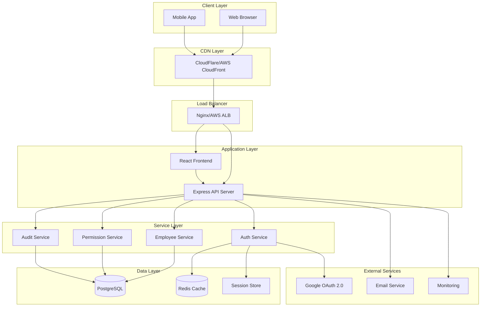
```mermaid
graph TB
    subgraph "Client Layer"
        A[Web Browser]
        B[Mobile App]
    end
    
    subgraph "CDN Layer"
        C[CloudFlare/AWS CloudFront]
    end
    
    subgraph "Load Balancer"
        D[Nginx/AWS ALB]
    end
    
    subgraph "Application Layer"
        E[React Frontend]
        F[Express API Server]
    end
    
    subgraph "Service Layer"
        G[Auth Service]
        H[Employee Service]
        I[Permission Service]
        J[Audit Service]
    end
    
    subgraph "Data Layer"
        K[(PostgreSQL)]
        L[(Redis Cache)]
        M[Session Store]
    end
    
    subgraph "External Services"
        N[Google OAuth 2.0]
        O[Email Service]
        P[Monitoring]
    end
    
    A --> C
    B --> C
    C --> D
    D --> E
    D --> F
    E --> F
    F --> G
    F --> H
    F --> I
    F --> J
    G --> N
    G --> L
    G --> M
    H --> K
    I --> K
    J --> K
    F --> O
    F --> P
```

## Component Architecture

### 1. Frontend Architecture

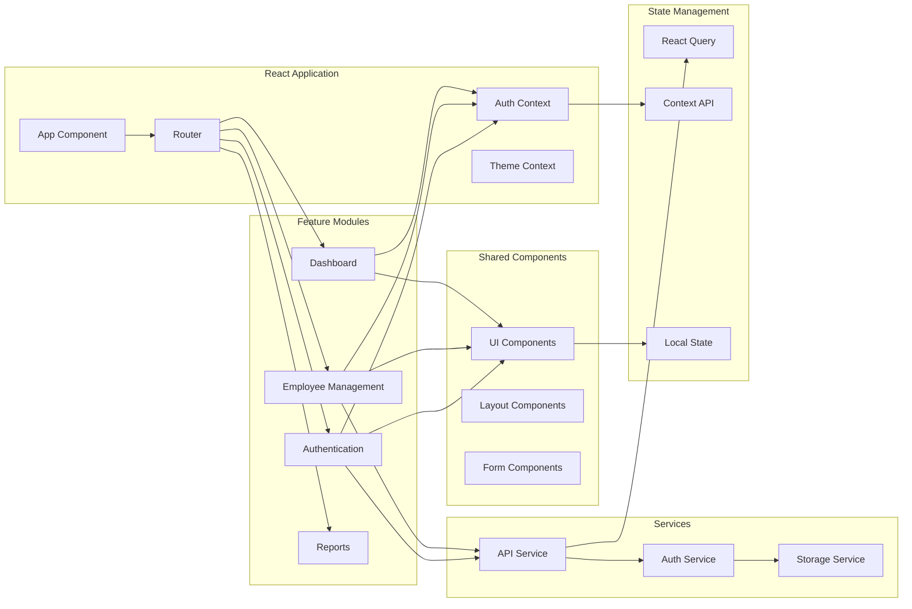
```mermaid
graph LR
    subgraph "React Application"
        A[App Component]
        B[Router]
        C[Auth Context]
        D[Theme Context]
    end
    
    subgraph "Feature Modules"
        E[Authentication]
        F[Employee Management]
        G[Dashboard]
        H[Reports]
    end
    
    subgraph "Shared Components"
        I[UI Components]
        J[Layout Components]
        K[Form Components]
    end
    
    subgraph "Services"
        L[API Service]
        M[Auth Service]
        N[Storage Service]
    end
    
    subgraph "State Management"
        O[React Query]
        P[Context API]
        Q[Local State]
    end
    
    A --> B
    B --> E
    B --> F
    B --> G
    B --> H
    
    E --> C
    F --> C
    G --> C
    
    E --> I
    F --> I
    G --> I
    
    E --> L
    F --> L
    
    L --> M
    M --> N
    
    L --> O
    C --> P
    I --> Q
```

### 2. Backend Architecture

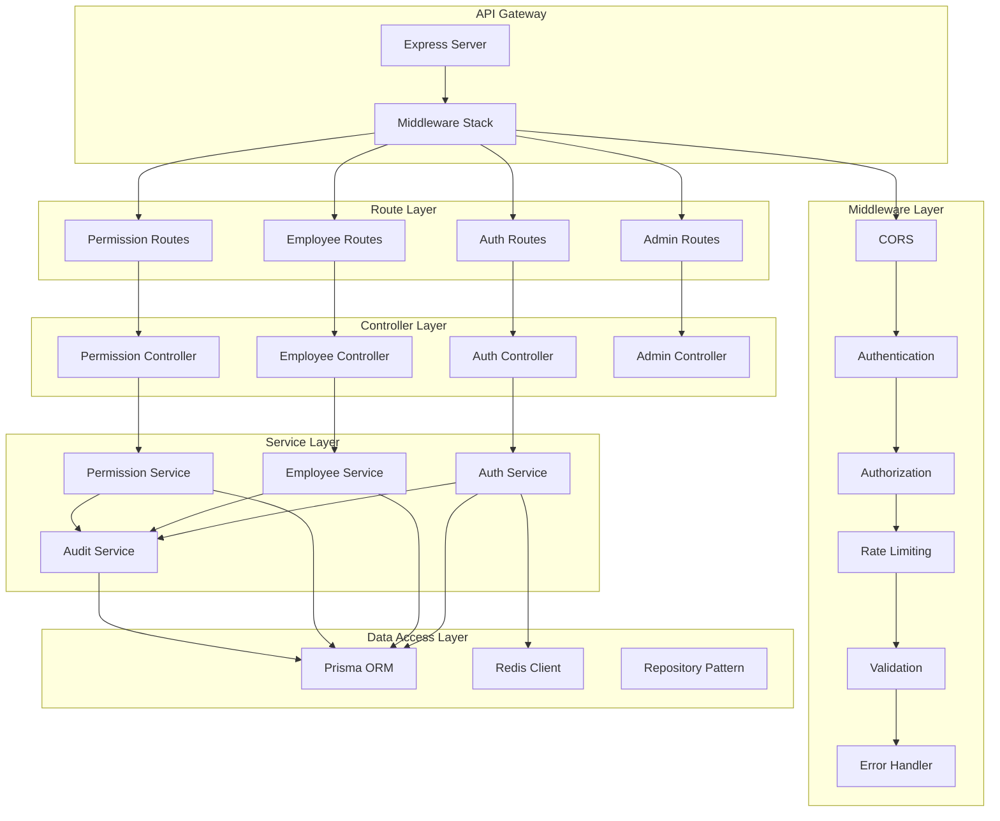
```mermaid
graph TB
    subgraph "API Gateway"
        A[Express Server]
        B[Middleware Stack]
    end
    
    subgraph "Middleware Layer"
        C[CORS]
        D[Authentication]
        E[Authorization]
        F[Rate Limiting]
        G[Validation]
        H[Error Handler]
    end
    
    subgraph "Route Layer"
        I[Auth Routes]
        J[Employee Routes]
        K[Permission Routes]
        L[Admin Routes]
    end
    
    subgraph "Controller Layer"
        M[Auth Controller]
        N[Employee Controller]
        O[Permission Controller]
        P[Admin Controller]
    end
    
    subgraph "Service Layer"
        Q[Auth Service]
        R[Employee Service]
        S[Permission Service]
        T[Audit Service]
    end
    
    subgraph "Data Access Layer"
        U[Prisma ORM]
        V[Redis Client]
        W[Repository Pattern]
    end
    
    A --> B
    B --> C
    C --> D
    D --> E
    E --> F
    F --> G
    G --> H
    
    B --> I
    B --> J
    B --> K
    B --> L
    
    I --> M
    J --> N
    K --> O
    L --> P
    
    M --> Q
    N --> R
    O --> S
    
    Q --> T
    R --> T
    S --> T
    
    Q --> U
    Q --> V
    R --> U
    S --> U
    T --> U
```

### 3. Database Architecture

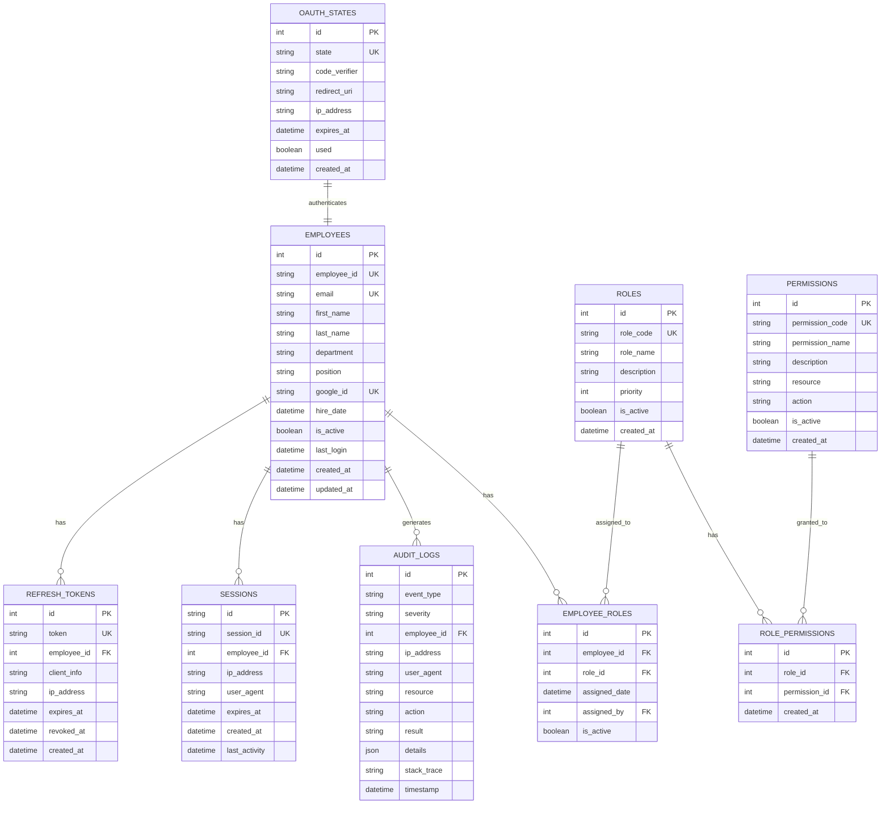
```mermaid
erDiagram
    EMPLOYEES ||--o{ EMPLOYEE_ROLES : has
    EMPLOYEES ||--o{ AUDIT_LOGS : generates
    EMPLOYEES ||--o{ SESSIONS : has
    EMPLOYEES ||--o{ REFRESH_TOKENS : has
    
    ROLES ||--o{ EMPLOYEE_ROLES : assigned_to
    ROLES ||--o{ ROLE_PERMISSIONS : has
    
    PERMISSIONS ||--o{ ROLE_PERMISSIONS : granted_to
    
    OAUTH_STATES ||--|| EMPLOYEES : authenticates
    
    EMPLOYEES {
        int id PK
        string employee_id UK
        string email UK
        string first_name
        string last_name
        string department
        string position
        string google_id UK
        datetime hire_date
        boolean is_active
        datetime last_login
        datetime created_at
        datetime updated_at
    }
    
    ROLES {
        int id PK
        string role_code UK
        string role_name
        string description
        int priority
        boolean is_active
        datetime created_at
    }
    
    PERMISSIONS {
        int id PK
        string permission_code UK
        string permission_name
        string description
        string resource
        string action
        boolean is_active
        datetime created_at
    }
    
    EMPLOYEE_ROLES {
        int id PK
        int employee_id FK
        int role_id FK
        datetime assigned_date
        int assigned_by FK
        boolean is_active
    }
    
    ROLE_PERMISSIONS {
        int id PK
        int role_id FK
        int permission_id FK
        datetime created_at
    }
    
    SESSIONS {
        string id PK
        string session_id UK
        int employee_id FK
        string ip_address
        string user_agent
        datetime expires_at
        datetime created_at
        datetime last_activity
    }
    
    REFRESH_TOKENS {
        int id PK
        string token UK
        int employee_id FK
        string client_info
        string ip_address
        datetime expires_at
        datetime revoked_at
        datetime created_at
    }
    
    AUDIT_LOGS {
        int id PK
        string event_type
        string severity
        int employee_id FK
        string ip_address
        string user_agent
        string resource
        string action
        string result
        json details
        string stack_trace
        datetime timestamp
    }
    
    OAUTH_STATES {
        int id PK
        string state UK
        string code_verifier
        string redirect_uri
        string ip_address
        datetime expires_at
        boolean used
        datetime created_at
    }
```

## Data Flow

### 1. Authentication Flow

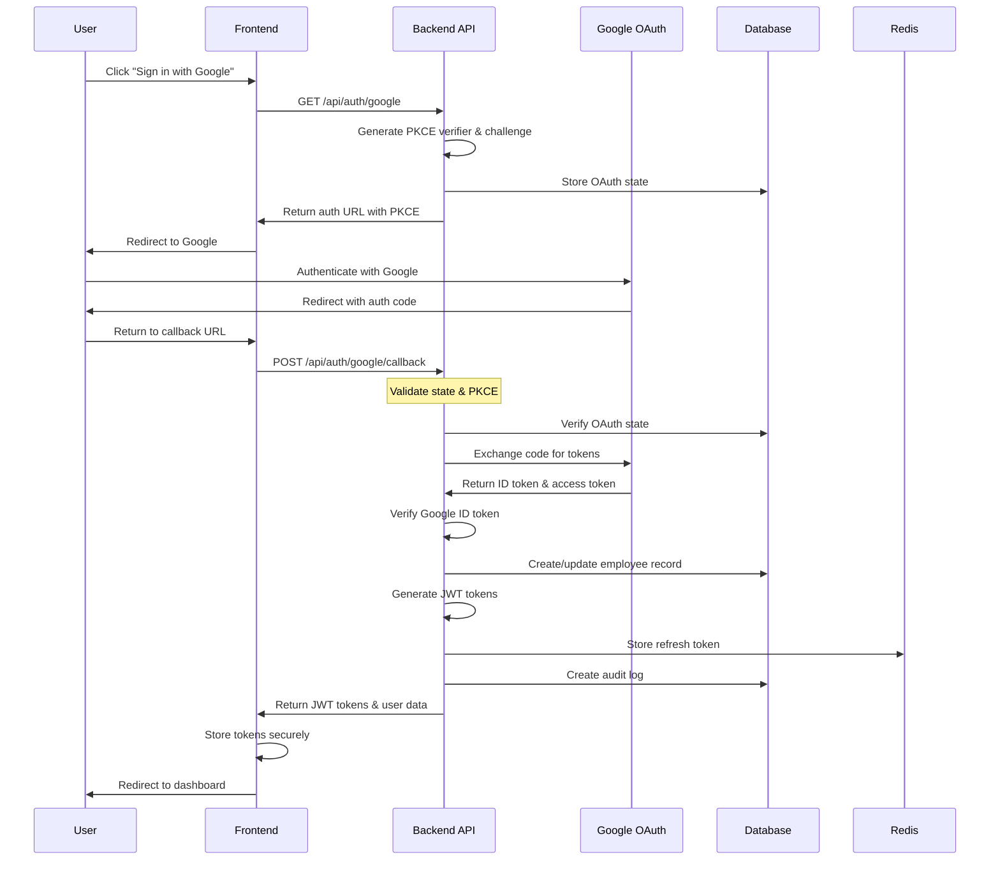
```mermaid
sequenceDiagram
    participant U as User
    participant F as Frontend
    participant B as Backend API
    participant G as Google OAuth
    participant D as Database
    participant R as Redis
    
    U->>F: Click "Sign in with Google"
    F->>B: GET /api/auth/google
    B->>B: Generate PKCE verifier & challenge
    B->>D: Store OAuth state
    B->>F: Return auth URL with PKCE
    F->>U: Redirect to Google
    
    U->>G: Authenticate with Google
    G->>U: Redirect with auth code
    U->>F: Return to callback URL
    
    F->>B: POST /api/auth/google/callback
    Note over B: Validate state & PKCE
    B->>D: Verify OAuth state
    B->>G: Exchange code for tokens
    G->>B: Return ID token & access token
    
    B->>B: Verify Google ID token
    B->>D: Create/update employee record
    B->>B: Generate JWT tokens
    B->>R: Store refresh token
    B->>D: Create audit log
    B->>F: Return JWT tokens & user data
    
    F->>F: Store tokens securely
    F->>U: Redirect to dashboard
```

### 2. API Request Flow

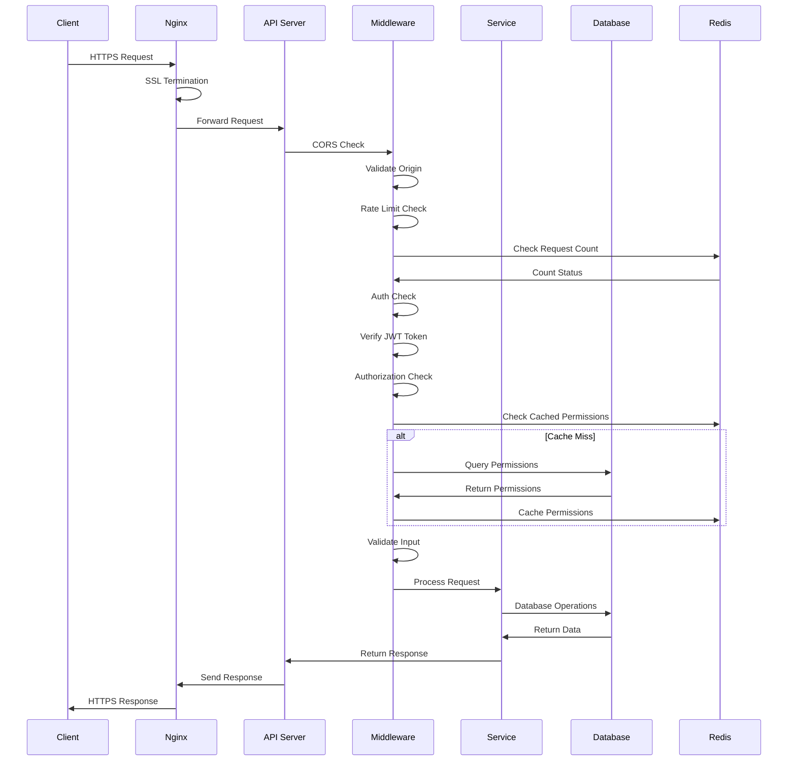
```mermaid
sequenceDiagram
    participant C as Client
    participant N as Nginx
    participant A as API Server
    participant M as Middleware
    participant S as Service
    participant D as Database
    participant R as Redis
    
    C->>N: HTTPS Request
    N->>N: SSL Termination
    N->>A: Forward Request
    
    A->>M: CORS Check
    M->>M: Validate Origin
    
    M->>M: Rate Limit Check
    M->>R: Check Request Count
    R->>M: Count Status
    
    M->>M: Auth Check
    M->>M: Verify JWT Token
    
    M->>M: Authorization Check
    M->>R: Check Cached Permissions
    alt Cache Miss
        M->>D: Query Permissions
        D->>M: Return Permissions
        M->>R: Cache Permissions
    end
    
    M->>M: Validate Input
    M->>S: Process Request
    
    S->>D: Database Operations
    D->>S: Return Data
    
    S->>A: Return Response
    A->>N: Send Response
    N->>C: HTTPS Response
```

## Security Architecture

### 1. Security Layers

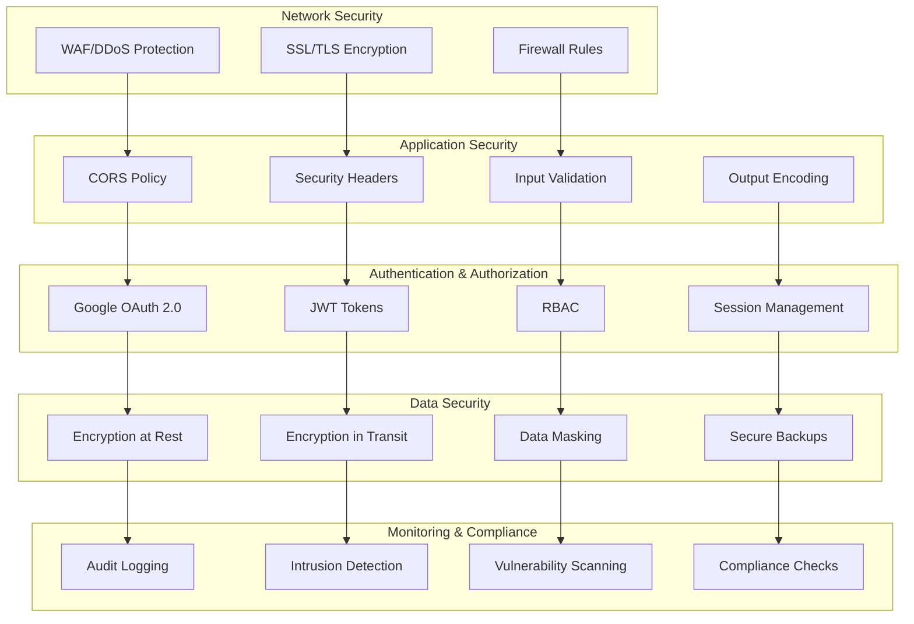
```mermaid
graph TB
    subgraph "Network Security"
        A[WAF/DDoS Protection]
        B[SSL/TLS Encryption]
        C[Firewall Rules]
    end
    
    subgraph "Application Security"
        D[CORS Policy]
        E[Security Headers]
        F[Input Validation]
        G[Output Encoding]
    end
    
    subgraph "Authentication & Authorization"
        H[Google OAuth 2.0]
        I[JWT Tokens]
        J[RBAC]
        K[Session Management]
    end
    
    subgraph "Data Security"
        L[Encryption at Rest]
        M[Encryption in Transit]
        N[Data Masking]
        O[Secure Backups]
    end
    
    subgraph "Monitoring & Compliance"
        P[Audit Logging]
        Q[Intrusion Detection]
        R[Vulnerability Scanning]
        S[Compliance Checks]
    end
    
    A --> D
    B --> E
    C --> F
    
    D --> H
    E --> I
    F --> J
    G --> K
    
    H --> L
    I --> M
    J --> N
    K --> O
    
    L --> P
    M --> Q
    N --> R
    O --> S
```

### 2. OAuth 2.0 + PKCE Implementation

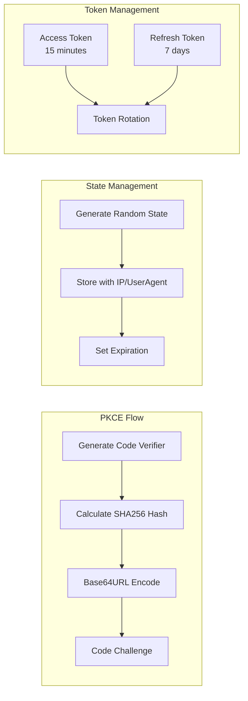
```mermaid
graph LR
    subgraph "PKCE Flow"
        A[Generate Code Verifier]
        B[Calculate SHA256 Hash]
        C[Base64URL Encode]
        D[Code Challenge]
    end
    
    subgraph "State Management"
        E[Generate Random State]
        F[Store with IP/UserAgent]
        G[Set Expiration]
    end
    
    subgraph "Token Management"
        H[Access Token<br/>15 minutes]
        I[Refresh Token<br/>7 days]
        J[Token Rotation]
    end
    
    A --> B
    B --> C
    C --> D
    
    E --> F
    F --> G
    
    H --> J
    I --> J
```

## Database Design

### 1. Data Model Relationships

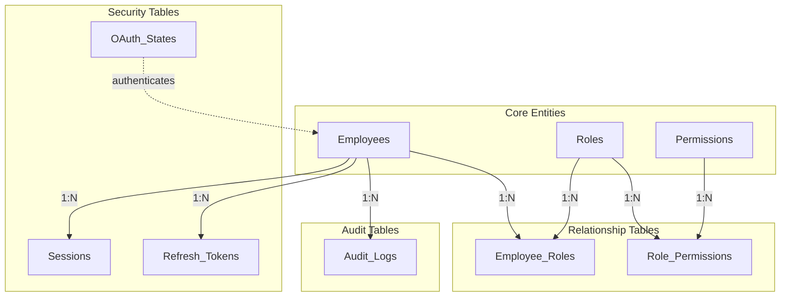
```mermaid
graph TB
    subgraph "Core Entities"
        A[Employees]
        B[Roles]
        C[Permissions]
    end
    
    subgraph "Relationship Tables"
        D[Employee_Roles]
        E[Role_Permissions]
    end
    
    subgraph "Security Tables"
        F[Sessions]
        G[Refresh_Tokens]
        H[OAuth_States]
    end
    
    subgraph "Audit Tables"
        I[Audit_Logs]
    end
    
    A -->|1:N| D
    B -->|1:N| D
    B -->|1:N| E
    C -->|1:N| E
    
    A -->|1:N| F
    A -->|1:N| G
    A -->|1:N| I
    
    H -.->|authenticates| A
```

### 2. Index Strategy

```sql
-- Performance Indexes
CREATE INDEX idx_employees_email ON employees(email);
CREATE INDEX idx_employees_google_id ON employees(google_id);
CREATE INDEX idx_employees_department ON employees(department) WHERE is_active = true;

CREATE INDEX idx_employee_roles_employee_id ON employee_roles(employee_id);
CREATE INDEX idx_employee_roles_role_id ON employee_roles(role_id);

CREATE INDEX idx_audit_logs_employee_id ON audit_logs(employee_id);
CREATE INDEX idx_audit_logs_timestamp ON audit_logs(timestamp DESC);
CREATE INDEX idx_audit_logs_event_type ON audit_logs(event_type);

-- Composite Indexes
CREATE INDEX idx_permissions_resource_action ON permissions(resource, action);
CREATE INDEX idx_sessions_employee_expires ON sessions(employee_id, expires_at);

-- Unique Constraints
CREATE UNIQUE INDEX idx_employee_role_unique ON employee_roles(employee_id, role_id);
CREATE UNIQUE INDEX idx_role_permission_unique ON role_permissions(role_id, permission_id);
```

## API Architecture

### 1. RESTful API Design

```yaml
/api:
  /auth:
    /google:
      get:
        summary: Get Google OAuth URL
        security: []
        responses:
          200:
            description: OAuth URL with PKCE parameters
            
    /google/callback:
      post:
        summary: Handle OAuth callback
        security: []
        requestBody:
          required: true
          content:
            application/json:
              schema:
                type: object
                properties:
                  code: string
                  state: string
                  codeVerifier: string
                  
    /refresh:
      post:
        summary: Refresh access token
        security: []
        
    /logout:
      post:
        summary: Logout user
        security: [bearerAuth]
        
    /me:
      get:
        summary: Get current user
        security: [bearerAuth]
        
  /employees:
    get:
      summary: List employees
      security: [bearerAuth]
      parameters:
        - name: page
          in: query
          schema:
            type: integer
        - name: limit
          in: query
          schema:
            type: integer
        - name: search
          in: query
          schema:
            type: string
            
    /{id}:
      get:
        summary: Get employee details
        security: [bearerAuth]
        
      put:
        summary: Update employee
        security: [bearerAuth]
        
    /{id}/roles:
      post:
        summary: Assign role
        security: [bearerAuth]
        
  /permissions:
    /check:
      post:
        summary: Check permissions
        security: [bearerAuth]
```

### 2. API Gateway Pattern

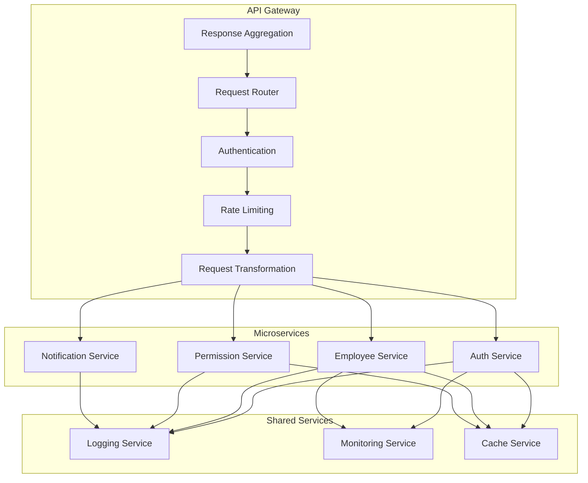
```mermaid
graph TB
    subgraph "API Gateway"
        A[Request Router]
        B[Authentication]
        C[Rate Limiting]
        D[Request Transformation]
        E[Response Aggregation]
    end
    
    subgraph "Microservices"
        F[Auth Service]
        G[Employee Service]
        H[Permission Service]
        I[Notification Service]
    end
    
    subgraph "Shared Services"
        J[Logging Service]
        K[Monitoring Service]
        L[Cache Service]
    end
    
    A --> B
    B --> C
    C --> D
    
    D --> F
    D --> G
    D --> H
    D --> I
    
    E --> A
    
    F --> J
    G --> J
    H --> J
    I --> J
    
    F --> K
    G --> K
    
    F --> L
    G --> L
    H --> L
```

## Frontend Architecture

### 1. Component Hierarchy

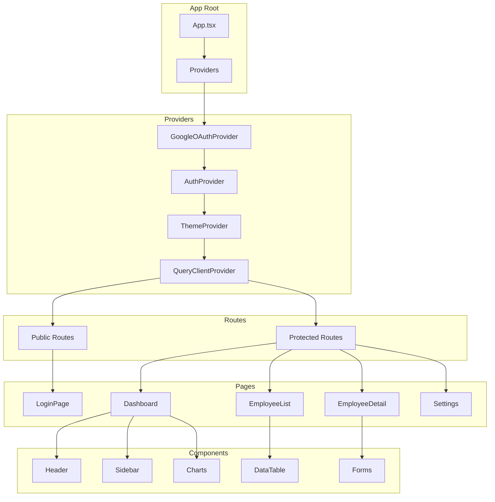
```mermaid
graph TB
    subgraph "App Root"
        A[App.tsx]
        B[Providers]
    end
    
    subgraph "Providers"
        C[GoogleOAuthProvider]
        D[AuthProvider]
        E[ThemeProvider]
        F[QueryClientProvider]
    end
    
    subgraph "Routes"
        G[Public Routes]
        H[Protected Routes]
    end
    
    subgraph "Pages"
        I[LoginPage]
        J[Dashboard]
        K[EmployeeList]
        L[EmployeeDetail]
        M[Settings]
    end
    
    subgraph "Components"
        N[Header]
        O[Sidebar]
        P[DataTable]
        Q[Forms]
        R[Charts]
    end
    
    A --> B
    B --> C
    C --> D
    D --> E
    E --> F
    
    F --> G
    F --> H
    
    G --> I
    H --> J
    H --> K
    H --> L
    H --> M
    
    J --> N
    J --> O
    K --> P
    L --> Q
    J --> R
```

### 2. State Management

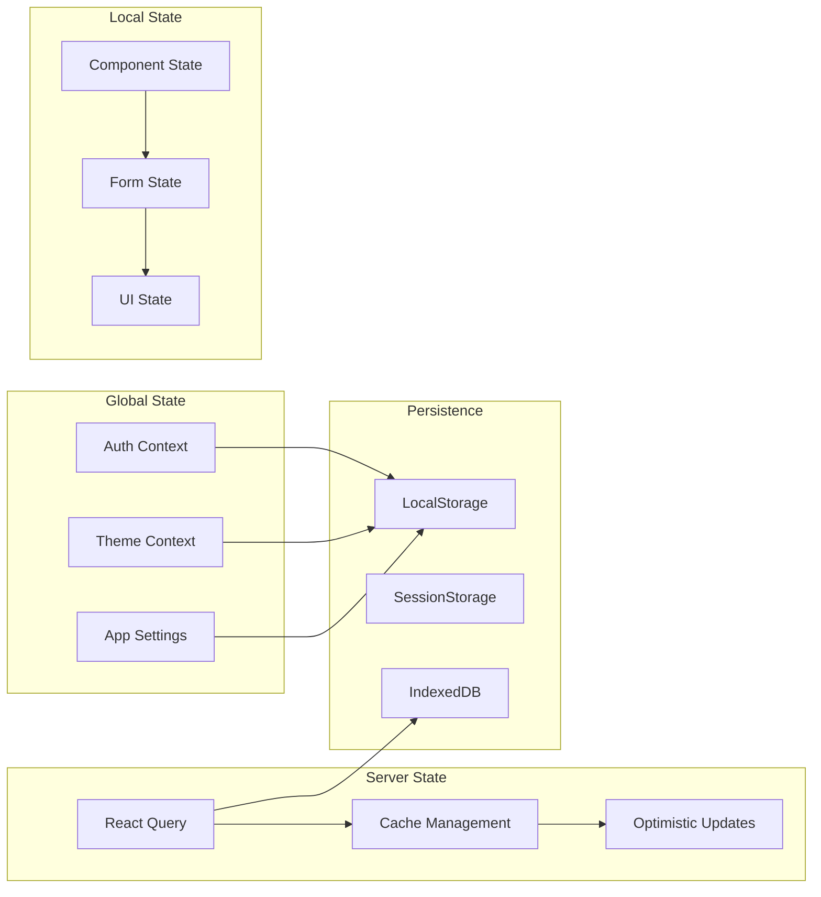
```mermaid
graph LR
    subgraph "Global State"
        A[Auth Context]
        B[Theme Context]
        C[App Settings]
    end
    
    subgraph "Server State"
        D[React Query]
        E[Cache Management]
        F[Optimistic Updates]
    end
    
    subgraph "Local State"
        G[Component State]
        H[Form State]
        I[UI State]
    end
    
    subgraph "Persistence"
        J[LocalStorage]
        K[SessionStorage]
        L[IndexedDB]
    end
    
    A --> J
    B --> J
    C --> J
    
    D --> E
    E --> F
    
    G --> H
    H --> I
    
    D --> L
```

## Infrastructure Architecture

### 1. Container Architecture

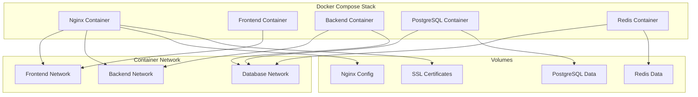
```mermaid
graph TB
    subgraph "Docker Compose Stack"
        A[Nginx Container]
        B[Frontend Container]
        C[Backend Container]
        D[PostgreSQL Container]
        E[Redis Container]
    end
    
    subgraph "Container Network"
        F[Frontend Network]
        G[Backend Network]
        H[Database Network]
    end
    
    subgraph "Volumes"
        I[PostgreSQL Data]
        J[Redis Data]
        K[Nginx Config]
        L[SSL Certificates]
    end
    
    A --> F
    A --> G
    B --> F
    C --> G
    C --> H
    D --> H
    E --> H
    
    D --> I
    E --> J
    A --> K
    A --> L
```

### 2. Deployment Architecture

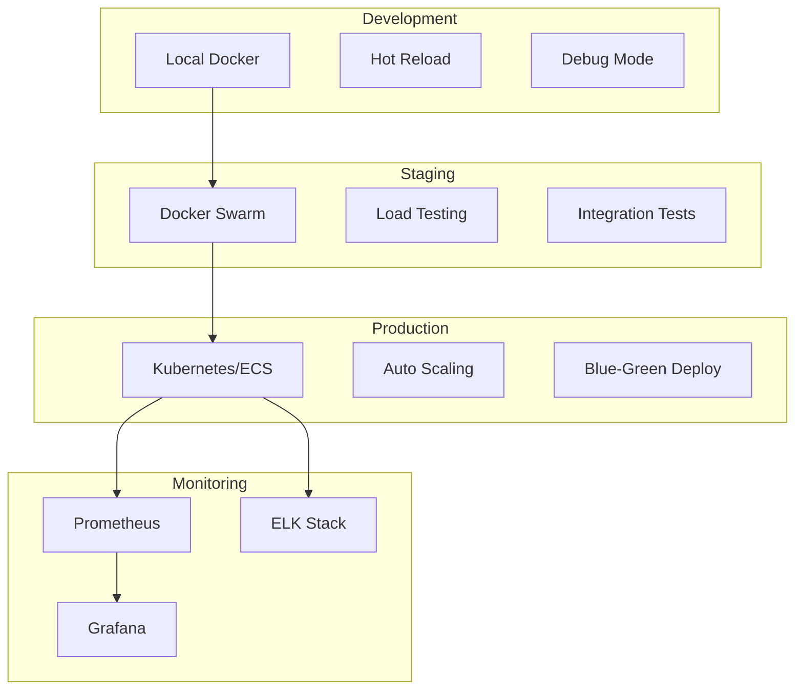
```mermaid
graph TB
    subgraph "Development"
        A[Local Docker]
        B[Hot Reload]
        C[Debug Mode]
    end
    
    subgraph "Staging"
        D[Docker Swarm]
        E[Load Testing]
        F[Integration Tests]
    end
    
    subgraph "Production"
        G[Kubernetes/ECS]
        H[Auto Scaling]
        I[Blue-Green Deploy]
    end
    
    subgraph "Monitoring"
        J[Prometheus]
        K[Grafana]
        L[ELK Stack]
    end
    
    A --> D
    D --> G
    
    G --> J
    J --> K
    G --> L
```

## Scalability Considerations

### 1. Horizontal Scaling Strategy

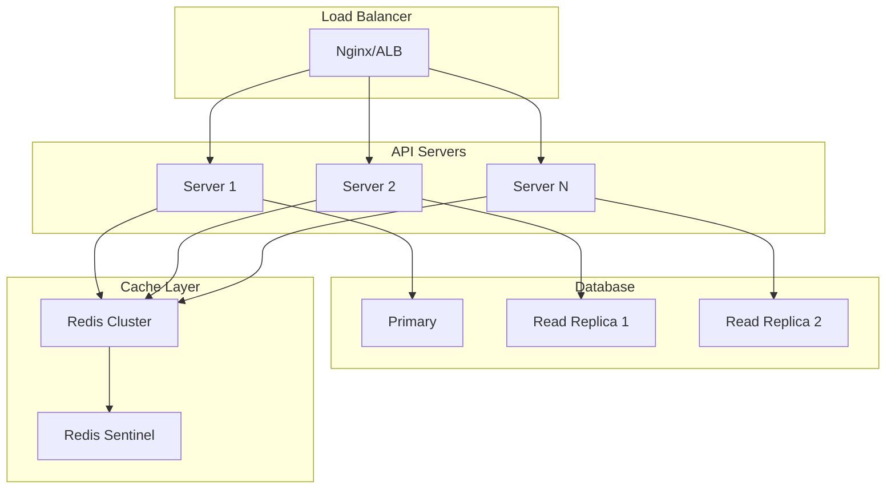
```mermaid
graph TB
    subgraph "Load Balancer"
        A[Nginx/ALB]
    end
    
    subgraph "API Servers"
        B[Server 1]
        C[Server 2]
        D[Server N]
    end
    
    subgraph "Database"
        E[Primary]
        F[Read Replica 1]
        G[Read Replica 2]
    end
    
    subgraph "Cache Layer"
        H[Redis Cluster]
        I[Redis Sentinel]
    end
    
    A --> B
    A --> C
    A --> D
    
    B --> E
    C --> F
    D --> G
    
    B --> H
    C --> H
    D --> H
    
    H --> I
```

### 2. Performance Optimization

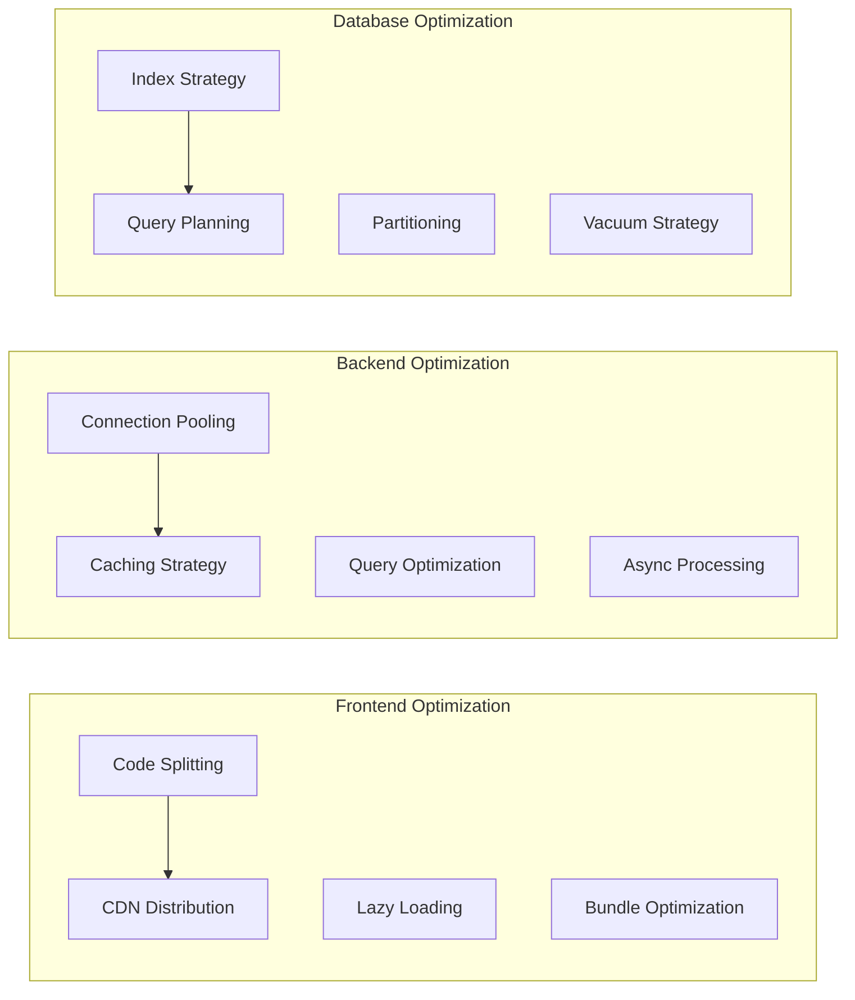
```mermaid
graph LR
    subgraph "Frontend Optimization"
        A[Code Splitting]
        B[Lazy Loading]
        C[Bundle Optimization]
        D[CDN Distribution]
    end
    
    subgraph "Backend Optimization"
        E[Connection Pooling]
        F[Query Optimization]
        G[Caching Strategy]
        H[Async Processing]
    end
    
    subgraph "Database Optimization"
        I[Index Strategy]
        J[Query Planning]
        K[Partitioning]
        L[Vacuum Strategy]
    end
    
    A --> D
    E --> G
    I --> J
```

## Technology Decision Matrix

| Component | Technology | Rationale |
|-----------|------------|-----------|
| Frontend Framework | React 18.2 | Component reusability, large ecosystem, strong TypeScript support |
| Backend Framework | Express + Node.js | JavaScript consistency, excellent async support, mature ecosystem |
| Database | PostgreSQL 15 | ACID compliance, JSON support, excellent performance |
| ORM | Prisma | Type safety, migration management, excellent DX |
| Cache | Redis 7.0 | Performance, pub/sub capability, session management |
| Authentication | Google OAuth 2.0 | Enterprise standard, secure, user convenience |
| Container | Docker | Consistency across environments, easy deployment |
| Reverse Proxy | Nginx | Performance, SSL termination, load balancing |

## Architectural Patterns

### 1. Design Patterns Used

- **Repository Pattern**: Data access abstraction
- **Service Layer Pattern**: Business logic encapsulation
- **Factory Pattern**: Object creation (JWT tokens, services)
- **Singleton Pattern**: Database connections, cache clients
- **Observer Pattern**: Event-driven audit logging
- **Strategy Pattern**: Authentication strategies
- **Middleware Pattern**: Request processing pipeline

### 2. Security Patterns

- **Defense in Depth**: Multiple security layers
- **Zero Trust Architecture**: Verify everything
- **Principle of Least Privilege**: Minimal permissions
- **Secure by Default**: Security enabled from start

### 3. Scalability Patterns

- **Database Connection Pooling**: Efficient resource usage
- **Caching Strategy**: Multi-level caching
- **Load Balancing**: Distribute traffic
- **Horizontal Scaling**: Add more instances

## Future Architecture Considerations

### 1. Microservices Migration Path

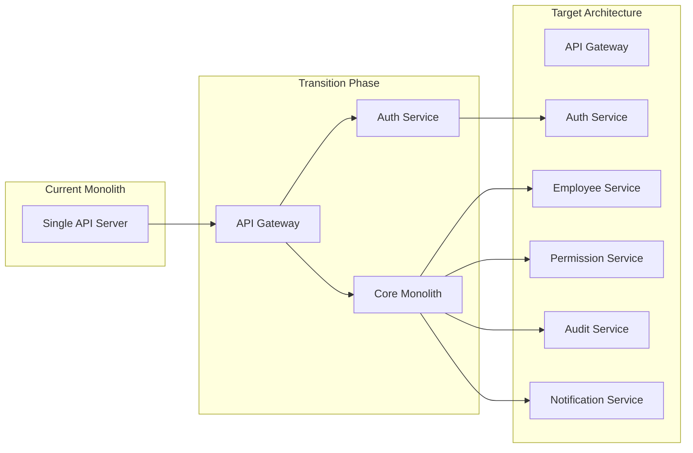
```mermaid
graph LR
    subgraph "Current Monolith"
        A[Single API Server]
    end
    
    subgraph "Transition Phase"
        B[API Gateway]
        C[Auth Service]
        D[Core Monolith]
    end
    
    subgraph "Target Architecture"
        E[API Gateway]
        F[Auth Service]
        G[Employee Service]
        H[Permission Service]
        I[Audit Service]
        J[Notification Service]
    end
    
    A --> B
    B --> C
    B --> D
    
    C --> F
    D --> G
    D --> H
    D --> I
    D --> J
```

### 2. Event-Driven Architecture

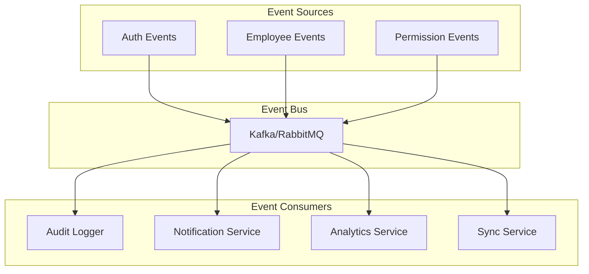
```mermaid
graph TB
    subgraph "Event Sources"
        A[Auth Events]
        B[Employee Events]
        C[Permission Events]
    end
    
    subgraph "Event Bus"
        D[Kafka/RabbitMQ]
    end
    
    subgraph "Event Consumers"
        E[Audit Logger]
        F[Notification Service]
        G[Analytics Service]
        H[Sync Service]
    end
    
    A --> D
    B --> D
    C --> D
    
    D --> E
    D --> F
    D --> G
    D --> H
```

## Architectural Decisions Record (ADR)

### ADR-001: Use PostgreSQL instead of MongoDB
- **Status**: Accepted
- **Context**: Need reliable, ACID-compliant database for employee data
- **Decision**: Use PostgreSQL for strong consistency and relational data
- **Consequences**: Better data integrity, complex queries support, but less flexible schema

### ADR-002: Implement PKCE for OAuth
- **Status**: Accepted
- **Context**: Google requires enhanced security for OAuth flows
- **Decision**: Implement PKCE even for confidential clients
- **Consequences**: Enhanced security, protection against code injection

### ADR-003: Use JWT for session management
- **Status**: Accepted
- **Context**: Need stateless authentication for scalability
- **Decision**: Use JWT with short-lived access tokens and refresh tokens
- **Consequences**: Stateless auth, better scalability, but token revocation complexity

### ADR-004: Backend proxy pattern for OAuth
- **Status**: Accepted
- **Context**: Client secret must not be exposed to frontend
- **Decision**: All OAuth flows go through backend
- **Consequences**: More secure, but additional backend load

---

Document Version: 1.0.0  
Last Updated: 2025-08-10  
Maintained by: Architecture Team