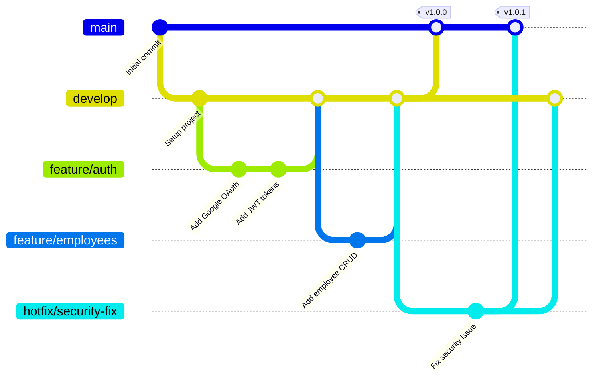
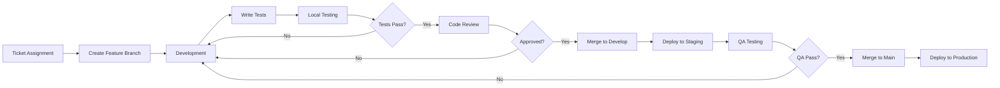
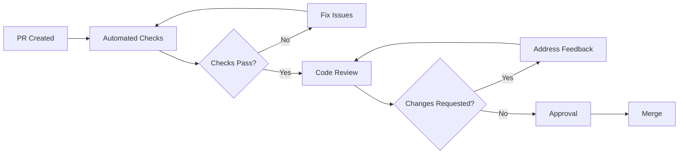
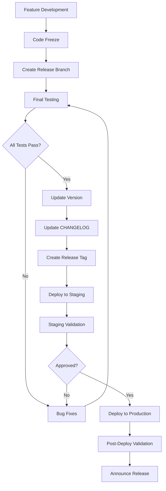

# Development Workflow Documentation - Google Authentication Employee Management System

## Table of Contents
1. [Development Environment Setup](#development-environment-setup)
2. [Git Workflow](#git-workflow)
3. [Development Process](#development-process)
4. [Coding Standards](#coding-standards)
5. [Testing Workflow](#testing-workflow)
6. [Code Review Process](#code-review-process)
7. [Debugging Workflow](#debugging-workflow)
8. [Documentation Workflow](#documentation-workflow)
9. [Release Process](#release-process)
10. [Best Practices](#best-practices)

## Development Environment Setup

### 1. Initial Setup

#### Prerequisites Installation
```bash
# Install Node.js 18.x
curl -fsSL https://deb.nodesource.com/setup_18.x | sudo -E bash -
sudo apt-get install -y nodejs

# Verify installation
node --version  # Should be 18.x
npm --version   # Should be 9.x or higher

# Install pnpm (optional, faster alternative to npm)
npm install -g pnpm

# Install development tools
npm install -g typescript@latest
npm install -g @types/node@latest
npm install -g ts-node@latest
npm install -g nodemon@latest
```

#### Repository Setup
```bash
# Clone repository
git clone https://github.com/your-org/google-auth-employee-system.git
cd google-auth-employee-system

# Install dependencies
npm run install:all

# Copy environment files
cp backend/.env.example backend/.env
cp frontend/.env.example frontend/.env

# Configure environment variables
# Edit .env files with your local settings
```

#### Database Setup
```bash
# Using Docker (recommended)
docker-compose up -d postgres redis

# Or install locally
# PostgreSQL 15
sudo apt-get install postgresql-15 postgresql-client-15

# Redis 7
sudo apt-get install redis-server

# Create database
createdb -U postgres employee_dev

# Run migrations
cd backend
npm run db:migrate

# Seed development data
npm run db:seed
```

### 2. IDE Configuration

#### VS Code Setup
```json
// .vscode/settings.json
{
  "editor.formatOnSave": true,
  "editor.codeActionsOnSave": {
    "source.fixAll.eslint": true
  },
  "typescript.tsdk": "node_modules/typescript/lib",
  "typescript.enablePromptUseWorkspaceTsdk": true,
  "editor.rulers": [80, 100],
  "files.exclude": {
    "**/node_modules": true,
    "**/dist": true,
    "**/.next": true,
    "**/build": true
  },
  "search.exclude": {
    "**/node_modules": true,
    "**/dist": true,
    "**/build": true,
    "**/.git": true
  }
}
```

#### Recommended Extensions
```json
// .vscode/extensions.json
{
  "recommendations": [
    "dbaeumer.vscode-eslint",
    "esbenp.prettier-vscode",
    "ms-vscode.vscode-typescript-tslint-plugin",
    "prisma.prisma",
    "bradlc.vscode-tailwindcss",
    "formulahendry.auto-rename-tag",
    "christian-kohler.path-intellisense",
    "mikestead.dotenv",
    "eamodio.gitlens",
    "mhutchie.git-graph",
    "streetsidesoftware.code-spell-checker"
  ]
}
```

### 3. Development Scripts

#### Package.json Scripts
```json
{
  "scripts": {
    // Development
    "dev": "concurrently \"npm run dev:backend\" \"npm run dev:frontend\"",
    "dev:backend": "cd backend && npm run dev",
    "dev:frontend": "cd frontend && npm start",
    
    // Building
    "build": "npm run build:backend && npm run build:frontend",
    "build:backend": "cd backend && npm run build",
    "build:frontend": "cd frontend && npm run build",
    
    // Testing
    "test": "npm run test:backend && npm run test:frontend",
    "test:backend": "cd backend && npm test",
    "test:frontend": "cd frontend && npm test",
    "test:e2e": "npm run test:e2e:backend && npm run test:e2e:frontend",
    
    // Code Quality
    "lint": "npm run lint:backend && npm run lint:frontend",
    "lint:backend": "cd backend && npm run lint",
    "lint:frontend": "cd frontend && npm run lint",
    "format": "npm run format:backend && npm run format:frontend",
    "typecheck": "npm run typecheck:backend && npm run typecheck:frontend",
    
    // Database
    "db:migrate": "cd backend && npm run db:migrate",
    "db:seed": "cd backend && npm run db:seed",
    "db:reset": "cd backend && npm run db:reset",
    
    // Docker
    "docker:up": "docker-compose up -d",
    "docker:down": "docker-compose down",
    "docker:logs": "docker-compose logs -f",
    
    // Utilities
    "clean": "npm run clean:backend && npm run clean:frontend",
    "clean:backend": "cd backend && rm -rf dist node_modules",
    "clean:frontend": "cd frontend && rm -rf build node_modules"
  }
}
```

## Git Workflow

### 1. Branch Strategy



### 2. Branch Naming Convention

```bash
# Feature branches
feature/add-employee-search
feature/implement-role-management
feature/upgrade-to-react-18

# Bug fix branches
bugfix/fix-login-redirect
bugfix/resolve-token-expiry
bugfix/correct-permission-check

# Hotfix branches (urgent production fixes)
hotfix/security-vulnerability
hotfix/critical-auth-fix

# Release branches
release/1.0.0
release/1.1.0

# Other branches
chore/update-dependencies
docs/api-documentation
refactor/simplify-auth-flow
```

### 3. Commit Message Convention

```bash
# Format: <type>(<scope>): <subject>

# Types:
# feat: New feature
# fix: Bug fix
# docs: Documentation changes
# style: Code style changes (formatting, missing semicolons, etc)
# refactor: Code refactoring
# perf: Performance improvements
# test: Adding tests
# chore: Maintenance tasks
# build: Build system changes
# ci: CI/CD changes

# Examples:
git commit -m "feat(auth): implement Google OAuth login"
git commit -m "fix(api): resolve token expiration issue"
git commit -m "docs(readme): update installation instructions"
git commit -m "refactor(employee): simplify data fetching logic"
git commit -m "test(auth): add unit tests for JWT service"
git commit -m "chore(deps): update dependencies to latest versions"

# With body and footer
git commit -m "feat(auth): add multi-factor authentication

Implement TOTP-based 2FA for enhanced security.
Users can now enable 2FA from their account settings.

Closes #123"
```

### 4. Pull Request Template

```markdown
<!-- .github/pull_request_template.md -->
## Description
Brief description of what this PR does

## Type of Change
- [ ] Bug fix (non-breaking change which fixes an issue)
- [ ] New feature (non-breaking change which adds functionality)
- [ ] Breaking change (fix or feature that would cause existing functionality to not work as expected)
- [ ] Documentation update
- [ ] Performance improvement
- [ ] Refactoring

## Changes Made
- Change 1
- Change 2
- Change 3

## Testing
- [ ] Unit tests pass
- [ ] Integration tests pass
- [ ] Manual testing completed
- [ ] No console errors

## Checklist
- [ ] My code follows the style guidelines
- [ ] I have performed a self-review
- [ ] I have commented my code, particularly in hard-to-understand areas
- [ ] I have made corresponding changes to the documentation
- [ ] My changes generate no new warnings
- [ ] I have added tests that prove my fix is effective or that my feature works
- [ ] New and existing unit tests pass locally
- [ ] Any dependent changes have been merged

## Screenshots (if applicable)
Add screenshots here

## Related Issues
Closes #(issue number)

## Additional Notes
Any additional information
```

## Development Process

### 1. Feature Development Workflow



### 2. Daily Development Routine

```bash
# Start of day
git checkout develop
git pull origin develop

# Create feature branch
git checkout -b feature/your-feature-name

# During development
npm run dev  # Start development servers

# Before committing
npm run lint  # Check linting
npm run typecheck  # Check types
npm run test  # Run tests

# Commit changes
git add .
git commit -m "feat(scope): description"

# Push changes
git push origin feature/your-feature-name

# Create pull request
# Use GitHub/GitLab UI or CLI
gh pr create --title "Feature: Your feature name" --body "Description"
```

### 3. Development Checklist

#### Before Starting
- [ ] Understand requirements clearly
- [ ] Check existing code and patterns
- [ ] Plan implementation approach
- [ ] Set up test data if needed

#### During Development
- [ ] Follow coding standards
- [ ] Write clean, readable code
- [ ] Add appropriate comments
- [ ] Handle error cases
- [ ] Consider edge cases
- [ ] Optimize for performance

#### Before Committing
- [ ] Run linter and fix issues
- [ ] Run type checker
- [ ] Write/update tests
- [ ] Update documentation
- [ ] Review your own code
- [ ] Check for console.logs

## Coding Standards

### 1. TypeScript Guidelines

```typescript
// ✅ Good: Use explicit types
interface Employee {
  id: number;
  email: string;
  firstName: string;
  lastName: string;
  roles: Role[];
}

// ❌ Bad: Avoid any
let data: any;

// ✅ Good: Use enums for constants
enum UserRole {
  SUPER_ADMIN = 'SUPER_ADMIN',
  ADMIN = 'ADMIN',
  MANAGER = 'MANAGER',
  EMPLOYEE = 'EMPLOYEE',
  VIEWER = 'VIEWER'
}

// ✅ Good: Use optional chaining
const department = employee?.department?.name;

// ✅ Good: Use nullish coalescing
const displayName = user.nickname ?? user.firstName;

// ✅ Good: Prefer const assertions
const config = {
  apiUrl: process.env.API_URL,
  timeout: 30000
} as const;

// ✅ Good: Use generics
function fetchData<T>(url: string): Promise<T> {
  return fetch(url).then(res => res.json());
}

// ✅ Good: Use utility types
type PartialEmployee = Partial<Employee>;
type ReadonlyEmployee = Readonly<Employee>;
type EmployeeKeys = keyof Employee;
```

### 2. React Guidelines

```typescript
// ✅ Good: Use functional components with TypeScript
interface Props {
  title: string;
  onClose: () => void;
  children: React.ReactNode;
}

const Modal: React.FC<Props> = ({ title, onClose, children }) => {
  return (
    <div className="modal">
      <h2>{title}</h2>
      <button onClick={onClose}>Close</button>
      {children}
    </div>
  );
};

// ✅ Good: Use custom hooks
const useAuth = () => {
  const [user, setUser] = useState<User | null>(null);
  const [loading, setLoading] = useState(true);

  useEffect(() => {
    // Auth logic
  }, []);

  return { user, loading };
};

// ✅ Good: Memoize expensive computations
const ExpensiveComponent: React.FC<Props> = ({ data }) => {
  const processedData = useMemo(() => {
    return expensiveOperation(data);
  }, [data]);

  return <div>{processedData}</div>;
};

// ✅ Good: Use error boundaries
class ErrorBoundary extends React.Component<Props, State> {
  componentDidCatch(error: Error, errorInfo: ErrorInfo) {
    console.error('Error caught:', error, errorInfo);
  }

  render() {
    if (this.state.hasError) {
      return <ErrorFallback />;
    }
    return this.props.children;
  }
}
```

### 3. Backend Guidelines

```typescript
// ✅ Good: Use dependency injection
export class EmployeeService {
  constructor(
    private prisma: PrismaClient,
    private auditService: AuditService
  ) {}

  async createEmployee(data: CreateEmployeeDto): Promise<Employee> {
    const employee = await this.prisma.employee.create({ data });
    
    await this.auditService.log({
      action: 'EMPLOYEE_CREATED',
      employeeId: employee.id,
      details: { email: employee.email }
    });

    return employee;
  }
}

// ✅ Good: Use proper error handling
export const asyncHandler = (
  fn: (req: Request, res: Response, next: NextFunction) => Promise<any>
) => {
  return (req: Request, res: Response, next: NextFunction) => {
    Promise.resolve(fn(req, res, next)).catch(next);
  };
};

// ✅ Good: Validate input
export const createEmployeeValidation = [
  body('email').isEmail().normalizeEmail(),
  body('firstName').trim().notEmpty().isLength({ max: 50 }),
  body('lastName').trim().notEmpty().isLength({ max: 50 }),
  body('roleId').isInt({ min: 1 })
];

// ✅ Good: Use transactions
async updateEmployeeWithRoles(id: number, data: UpdateData) {
  return await this.prisma.$transaction(async (tx) => {
    const employee = await tx.employee.update({
      where: { id },
      data: data.employee
    });

    await tx.employeeRole.deleteMany({
      where: { employeeId: id }
    });

    await tx.employeeRole.createMany({
      data: data.roles.map(roleId => ({
        employeeId: id,
        roleId
      }))
    });

    return employee;
  });
}
```

### 4. File and Folder Structure

```
src/
├── components/          # Reusable UI components
│   ├── common/         # Generic components
│   ├── forms/          # Form components
│   └── layout/         # Layout components
├── features/           # Feature-based modules
│   ├── auth/          # Authentication feature
│   ├── employees/     # Employee management
│   └── dashboard/     # Dashboard feature
├── hooks/             # Custom React hooks
├── services/          # API and external services
├── utils/             # Utility functions
├── types/             # TypeScript type definitions
├── constants/         # Application constants
└── styles/            # Global styles

backend/src/
├── controllers/       # Request handlers
├── services/         # Business logic
├── middleware/       # Express middleware
├── routes/           # API routes
├── models/           # Data models
├── utils/            # Utility functions
├── config/           # Configuration
├── types/            # TypeScript types
└── database/         # Database related
```

## Testing Workflow

### 1. Test Structure

```typescript
// Unit Test Example
describe('AuthService', () => {
  let authService: AuthService;
  let mockPrisma: PrismaClient;

  beforeEach(() => {
    mockPrisma = createMockPrismaClient();
    authService = new AuthService(mockPrisma);
  });

  describe('verifyGoogleToken', () => {
    it('should verify valid Google token', async () => {
      const mockToken = 'valid-google-token';
      const mockPayload = {
        email: 'user@example.com',
        sub: 'google-user-id'
      };

      jest.spyOn(authService, 'verifyToken')
        .mockResolvedValue(mockPayload);

      const result = await authService.verifyGoogleToken(mockToken);

      expect(result).toEqual(mockPayload);
      expect(authService.verifyToken).toHaveBeenCalledWith(mockToken);
    });

    it('should throw error for invalid token', async () => {
      const mockToken = 'invalid-token';

      jest.spyOn(authService, 'verifyToken')
        .mockRejectedValue(new Error('Invalid token'));

      await expect(authService.verifyGoogleToken(mockToken))
        .rejects.toThrow('Invalid token');
    });
  });
});

// Integration Test Example
describe('POST /api/auth/google/callback', () => {
  it('should authenticate user with valid code', async () => {
    const response = await request(app)
      .post('/api/auth/google/callback')
      .send({
        code: 'valid-auth-code',
        state: 'valid-state',
        codeVerifier: 'valid-verifier'
      })
      .expect(200);

    expect(response.body).toMatchObject({
      success: true,
      data: {
        accessToken: expect.any(String),
        refreshToken: expect.any(String),
        employee: {
          email: expect.any(String)
        }
      }
    });
  });
});

// E2E Test Example
describe('Authentication Flow', () => {
  it('should complete full authentication flow', async () => {
    // 1. Get auth URL
    const authUrlResponse = await request(baseURL)
      .get('/api/auth/google')
      .expect(200);

    const { authUrl, state } = authUrlResponse.body.data;

    // 2. Simulate OAuth callback
    const callbackResponse = await request(baseURL)
      .post('/api/auth/google/callback')
      .send({
        code: 'test-auth-code',
        state,
        codeVerifier: 'test-verifier'
      })
      .expect(200);

    const { accessToken } = callbackResponse.body.data;

    // 3. Access protected endpoint
    const meResponse = await request(baseURL)
      .get('/api/auth/me')
      .set('Authorization', `Bearer ${accessToken}`)
      .expect(200);

    expect(meResponse.body.data).toHaveProperty('email');
  });
});
```

### 2. Testing Commands

```bash
# Run all tests
npm test

# Run tests in watch mode
npm run test:watch

# Run tests with coverage
npm run test:coverage

# Run specific test file
npm test -- auth.test.ts

# Run tests matching pattern
npm test -- --testNamePattern="should authenticate"

# Run integration tests only
npm run test:integration

# Run E2E tests
npm run test:e2e

# Update snapshots
npm test -- -u
```

### 3. Test Coverage Requirements

```javascript
// jest.config.js
module.exports = {
  coverageThreshold: {
    global: {
      branches: 80,
      functions: 80,
      lines: 80,
      statements: 80
    },
    './src/services/': {
      branches: 90,
      functions: 90,
      lines: 90,
      statements: 90
    }
  }
};
```

## Code Review Process

### 1. Review Checklist

#### Code Quality
- [ ] Code follows project conventions
- [ ] No unnecessary complexity
- [ ] DRY principle followed
- [ ] SOLID principles applied
- [ ] Proper error handling
- [ ] No hardcoded values

#### Security
- [ ] No sensitive data exposed
- [ ] Input validation implemented
- [ ] SQL injection prevention
- [ ] XSS prevention measures
- [ ] Proper authentication checks
- [ ] Authorization properly implemented

#### Testing
- [ ] Unit tests written
- [ ] Integration tests added
- [ ] Edge cases covered
- [ ] Test coverage adequate
- [ ] Tests are meaningful

#### Documentation
- [ ] Code is self-documenting
- [ ] Complex logic commented
- [ ] API documentation updated
- [ ] README updated if needed
- [ ] CHANGELOG updated

### 2. Review Process



### 3. Review Comments

```typescript
// Good review comment example:
// "Consider using a map here for O(1) lookup instead of array.find() 
// which is O(n). This will improve performance when dealing with 
// large datasets."

// Bad review comment example:
// "This is wrong"

// Suggesting alternative:
// "What do you think about extracting this logic into a separate 
// utility function? It would improve reusability and testability."

// Security concern:
// "This endpoint seems to be missing authentication. Should we add 
// the authenticateToken middleware here?"
```

## Debugging Workflow

### 1. Backend Debugging

```typescript
// VS Code launch.json for backend debugging
{
  "version": "0.2.0",
  "configurations": [
    {
      "name": "Debug Backend",
      "type": "node",
      "request": "launch",
      "runtimeExecutable": "npm",
      "runtimeArgs": ["run", "dev"],
      "cwd": "${workspaceFolder}/backend",
      "console": "integratedTerminal",
      "env": {
        "NODE_ENV": "development",
        "DEBUG": "*"
      }
    },
    {
      "name": "Debug Current Test",
      "type": "node",
      "request": "launch",
      "program": "${workspaceFolder}/backend/node_modules/.bin/jest",
      "args": ["${file}"],
      "console": "integratedTerminal",
      "cwd": "${workspaceFolder}/backend"
    }
  ]
}
```

### 2. Frontend Debugging

```typescript
// Browser debugging setup
// 1. Install React Developer Tools
// 2. Install Redux DevTools (if using Redux)
// 3. Use console.log strategically

// Debug component renders
useEffect(() => {
  console.log('Component rendered with props:', props);
});

// Debug API calls
const fetchData = async () => {
  console.group('API Call: /api/employees');
  console.log('Request:', { params });
  
  try {
    const response = await api.get('/employees', { params });
    console.log('Response:', response.data);
    console.groupEnd();
    return response.data;
  } catch (error) {
    console.error('Error:', error);
    console.groupEnd();
    throw error;
  }
};

// Performance debugging
const MyComponent = () => {
  // Track render count
  const renderCount = useRef(0);
  renderCount.current++;
  console.log(`Render #${renderCount.current}`);

  // Track why component re-rendered
  useEffect(() => {
    console.log('Props changed:', props);
  }, [props]);
};
```

### 3. Database Debugging

```sql
-- Enable query logging in PostgreSQL
ALTER SYSTEM SET log_statement = 'all';
SELECT pg_reload_conf();

-- Check slow queries
SELECT 
  query,
  calls,
  total_time,
  mean_time,
  max_time
FROM pg_stat_statements
ORDER BY mean_time DESC
LIMIT 10;

-- Monitor active connections
SELECT 
  pid,
  usename,
  application_name,
  client_addr,
  state,
  query_start,
  query
FROM pg_stat_activity
WHERE state != 'idle'
ORDER BY query_start;
```

## Documentation Workflow

### 1. Documentation Types

```markdown
# Code Documentation
- Inline comments for complex logic
- JSDoc/TSDoc for functions and classes
- README files for modules
- API documentation
- Architecture decision records (ADRs)

# User Documentation
- Installation guides
- Configuration guides
- User manuals
- FAQ sections
- Troubleshooting guides

# Developer Documentation
- Setup instructions
- Development workflows
- Coding standards
- API references
- Database schemas
```

### 2. Documentation Standards

```typescript
/**
 * Authenticates a user with Google OAuth 2.0
 * 
 * @param code - Authorization code from Google
 * @param state - State parameter for CSRF protection
 * @param codeVerifier - PKCE code verifier
 * @returns Promise containing user data and tokens
 * @throws {AuthenticationError} If authentication fails
 * @throws {ValidationError} If input validation fails
 * 
 * @example
 * ```typescript
 * const result = await authenticateWithGoogle({
 *   code: 'auth-code',
 *   state: 'state-string',
 *   codeVerifier: 'verifier'
 * });
 * ```
 */
export async function authenticateWithGoogle(
  params: GoogleAuthParams
): Promise<AuthResult> {
  // Implementation
}
```

### 3. API Documentation

```yaml
# OpenAPI/Swagger documentation
openapi: 3.0.0
info:
  title: Employee Management API
  version: 1.0.0
  description: API for managing employees with Google OAuth

paths:
  /api/auth/google:
    get:
      summary: Get Google OAuth URL
      tags: [Authentication]
      responses:
        200:
          description: OAuth URL with PKCE parameters
          content:
            application/json:
              schema:
                type: object
                properties:
                  success:
                    type: boolean
                  data:
                    type: object
                    properties:
                      authUrl:
                        type: string
                      state:
                        type: string
```

## Release Process

### 1. Release Workflow



### 2. Version Management

```bash
# Semantic Versioning: MAJOR.MINOR.PATCH

# Update version
npm version patch  # 1.0.0 -> 1.0.1
npm version minor  # 1.0.1 -> 1.1.0
npm version major  # 1.1.0 -> 2.0.0

# Create release tag
git tag -a v1.0.0 -m "Release version 1.0.0"
git push origin v1.0.0

# Generate changelog
npm run changelog
```

### 3. Release Checklist

#### Pre-Release
- [ ] All features completed
- [ ] All tests passing
- [ ] Code coverage meets requirements
- [ ] Security scan completed
- [ ] Performance testing done
- [ ] Documentation updated
- [ ] CHANGELOG updated
- [ ] Version numbers updated

#### Release
- [ ] Create release branch
- [ ] Final QA testing
- [ ] Create release tag
- [ ] Build production artifacts
- [ ] Deploy to staging
- [ ] Staging validation
- [ ] Deploy to production
- [ ] Production validation

#### Post-Release
- [ ] Monitor error rates
- [ ] Check performance metrics
- [ ] Update project board
- [ ] Announce release
- [ ] Archive release artifacts
- [ ] Plan next iteration

## Best Practices

### 1. Development Best Practices

```typescript
// ✅ Always handle errors properly
try {
  const result = await riskyOperation();
  return result;
} catch (error) {
  logger.error('Operation failed:', error);
  throw new AppError('Operation failed', 500);
}

// ✅ Use environment variables for configuration
const config = {
  apiUrl: process.env.API_URL || 'http://localhost:5000',
  timeout: parseInt(process.env.TIMEOUT || '30000', 10)
};

// ✅ Implement proper logging
logger.info('User authenticated', {
  userId: user.id,
  email: user.email,
  timestamp: new Date().toISOString()
});

// ✅ Use proper data validation
const schema = z.object({
  email: z.string().email(),
  password: z.string().min(8),
  role: z.enum(['admin', 'user'])
});

// ✅ Implement rate limiting
const limiter = rateLimit({
  windowMs: 15 * 60 * 1000,
  max: 100,
  message: 'Too many requests'
});
```

### 2. Security Best Practices

```typescript
// ✅ Never expose sensitive data
const sanitizeUser = (user: User) => {
  const { password, ...safeUser } = user;
  return safeUser;
};

// ✅ Always validate input
const validateInput = (input: any) => {
  if (typeof input !== 'string') {
    throw new ValidationError('Invalid input type');
  }
  
  // Sanitize to prevent XSS
  return DOMPurify.sanitize(input);
};

// ✅ Use prepared statements
const user = await prisma.user.findFirst({
  where: {
    email: email.toLowerCase(),
    isActive: true
  }
});

// ✅ Implement CSRF protection
app.use(csrf({ cookie: true }));

// ✅ Set security headers
app.use(helmet({
  contentSecurityPolicy: {
    directives: {
      defaultSrc: ["'self'"],
      styleSrc: ["'self'", "'unsafe-inline'"]
    }
  }
}));
```

### 3. Performance Best Practices

```typescript
// ✅ Use database indexes
CREATE INDEX idx_employees_email ON employees(email);
CREATE INDEX idx_employees_dept_active ON employees(department) 
  WHERE is_active = true;

// ✅ Implement caching
const getCachedData = async (key: string) => {
  const cached = await redis.get(key);
  if (cached) {
    return JSON.parse(cached);
  }
  
  const data = await fetchFromDatabase();
  await redis.setex(key, 3600, JSON.stringify(data));
  return data;
};

// ✅ Use pagination
const getEmployees = async (page = 1, limit = 20) => {
  const offset = (page - 1) * limit;
  
  const [employees, total] = await Promise.all([
    prisma.employee.findMany({
      take: limit,
      skip: offset,
      orderBy: { createdAt: 'desc' }
    }),
    prisma.employee.count()
  ]);
  
  return {
    data: employees,
    meta: {
      page,
      limit,
      total,
      pages: Math.ceil(total / limit)
    }
  };
};

// ✅ Optimize React renders
const ExpensiveComponent = React.memo(({ data }) => {
  const processedData = useMemo(() => 
    expensiveOperation(data), [data]
  );
  
  return <div>{processedData}</div>;
});
```

## Useful Commands Reference

```bash
# Development
npm run dev                    # Start development servers
npm run dev:backend           # Start backend only
npm run dev:frontend          # Start frontend only

# Building
npm run build                 # Build all
npm run build:backend        # Build backend
npm run build:frontend       # Build frontend

# Testing
npm test                     # Run all tests
npm run test:watch          # Run tests in watch mode
npm run test:coverage       # Run tests with coverage
npm run test:e2e            # Run E2E tests

# Database
npm run db:migrate          # Run migrations
npm run db:seed             # Seed database
npm run db:reset            # Reset database
npm run db:studio           # Open Prisma Studio

# Code Quality
npm run lint               # Run linter
npm run lint:fix           # Fix linting issues
npm run format             # Format code
npm run typecheck          # Check TypeScript

# Docker
npm run docker:up          # Start Docker containers
npm run docker:down        # Stop Docker containers
npm run docker:logs        # View Docker logs
npm run docker:build       # Build Docker images

# Utilities
npm run clean              # Clean build artifacts
npm run analyze            # Analyze bundle size
npm run generate:types     # Generate TypeScript types
npm run docs               # Generate documentation
```

---

Document Version: 1.0.0  
Last Updated: 2025-08-10  
Maintained by: Development Team